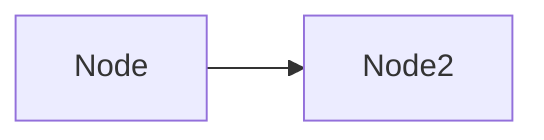

# CLAUDE.md

此文件为 Claude Code（claude.ai/code）在处理本代码库时提供指导。

## 项目定位

本仓库是 **Shirone-Admin 的官方文档站**——之于 [Shirone-Admin](https://github.com/bobokaka/Shirone-Admin)，正如 [vuejs.org](https://vuejs.org/) 之于 Vue。开源项目（Apache 2.0）。

- **Shirone-Admin**：[Shirone](https://github.com/LyraVoid/Shirone) 博客的可视化内容管理工具（本地单机运行、前后端分离、AI 辅助写作、一键双仓发布）
- **本仓库**：文档源码与站点配置，基于 VitePress 2.0 + Vue 3 + TypeScript，默认主题深度定制，9 种语言
- **上游联动**：同工作区的 `../Shirone-Admin` 是文档内容的唯一事实来源。上游功能变更时必须同步更新对应文档；文档不得虚构上游不存在的行为，存疑时先读上游源码或其 CLAUDE.md 求证

## 内容模型（核心）

所有文档内容从两类读者出发编写，对应两个内容板块：

| 读者 | 板块 | 目录 | 写法要求 |
|------|------|------|----------|
| 初学者（完全不了解 Shirone-Admin） | 指南 | `docs/<lang>/guide/` | 教程式：由浅入深、每步可复现、不预设任何背景知识；概念首次出现时就地解释或给出链接 |
| 熟练使用者 | API 参考 | `docs/<lang>/api/` | 字典式：条目完备、结构统一（用途/签名/参数/返回值/默认值/副作用）、可脱离上下文独立查阅、每条附最小可运行示例 |

- 以 `zh` 为基准语言，其余语言目录结构与条目一一对应；推荐顺序：先写 `zh` 校准内容 → 补 `en` → 其余语言按同一骨架翻译
- 示例必须真实可运行，禁止「示意性」伪代码冒充示例
- **禁止「模板」残留表述**：本站是 Shirone-Admin 的产品文档，不是可克隆的文档站模板，行文以 Shirone-Admin 为主体

## 开发命令

项目使用 **pnpm** 作为包管理器（Windows PowerShell 下使用 `pnpm.cmd`）：

```bash
pnpm install        # 安装依赖
pnpm run dev        # 启动开发服务器
pnpm run build      # 构建生产版本（约需 20GB 内存）
pnpm run preview    # 预览构建结果
```

### 构建资源警告（重要）

- **本项目完整构建需要约 20GB 内存**，普通电脑极有可能在构建过程中因内存耗尽而卡死。
- **开发调试请使用 `pnpm run dev`**：开发服务器增量编译，内存占用可控。
- **仅在确认内容无误并准备部署时执行构建**，且确保运行机器有充足内存（建议 32GB 以上）。

## 项目架构

### 目录结构

```
Shirone-Admin-API/
├── docs/                        # 文档根目录
│   ├── index.md                 # 根路径重定向到 /zh/
│   ├── zh/                      # 简体中文（默认语言、内容基准）
│   │   ├── index.md             # 首页（frontmatter 驱动）
│   │   ├── guide/               # 指南：面向初学者的教程
│   │   └── api/                 # API 参考：面向熟练使用者的字典
│   ├── zh-hant/  en/  ja/  ko/  fr/  de/  es/  ru/   # 其余 8 种语言，结构与 zh 对齐
│   │
│   └── .vitepress/
│       ├── config.mts           # 配置入口（从 config/ 导出）
│       ├── config/
│       │   ├── index.ts         # 主配置（主题、插件、Markdown、locales 注册）
│       │   ├── shared.ts        # 共享配置（hostname、head、sitemap）
│       │   ├── sidebar-generated.ts  # 侧边栏配置（按语言前缀组织）
│       │   └── locales/         # 各语言 locale 配置（zh.ts、en.ts 等 9 个）
│       ├── theme/               # 主题定制
│       │   ├── index.ts         # 主题入口（全局注册自定义组件）
│       │   ├── Layout.vue       # 自定义布局（首页由 HomeHighlights 渲染）
│       │   ├── components/      # HomeHighlights.vue、SiteInfo.vue
│       │   ├── composables/     # useMermaidLinks.ts
│       │   └── styles/          # index.css、mermaid-dark.css、rtl.css
│       └── public/              # 静态资源（favicon、logo、assets/）
│
├── .claude/                     # Claude Code 配置（commands + skills）
├── package.json
├── pnpm-lock.yaml
├── pnpm-workspace.yaml
└── tsconfig.json
```

### 多语言支持

支持 9 种语言：简体中文（`zh`）、繁体中文（`zh-hant`）、英文（`en`）、日文（`ja`）、韩文（`ko`）、法文（`fr`）、德文（`de`）、西班牙文（`es`）、俄文（`ru`）。每种语言在 `config/locales/` 下有独立的配置文件，内容在 `docs/<lang>/` 目录下。

### 已集成插件

- **vitepress-plugin-mermaid** - Mermaid 图表
- **vitepress-plugin-giscus** - Giscus 评论（需自配 repo/repoId）
- **vitepress-plugin-rss** - RSS 订阅
- **markdown-it-mark / sub / sup / footnote** - 高亮、上下标、脚注
- **MathJax 3** - 数学公式（VitePress 内置 math 支持）

### 主题定制

- 首页由 `Layout.vue` 的 `#home-hero-before` 插槽 + `HomeHighlights.vue` 组件统一渲染，通过页面 frontmatter 的 `hero` / `features` / `highlights` 字段驱动
- `SiteInfo` 为全局注册的卡片组件，可在任意 Markdown 中使用
- 全局样式：`theme/styles/index.css`；Mermaid 暗色：`mermaid-dark.css`；RTL：`rtl.css`

## 开发注意事项

### 1. 添加新文档页面

1. 在 `docs/<lang>/guide/` 或 `docs/<lang>/api/` 下创建 `.md` 文件（先写 `zh`，再同步其他语言）
2. 在 `docs/.vitepress/config/sidebar-generated.ts` 中补充对应语言前缀的侧边栏条目（key 形如 `/zh/guide/`，`config/index.ts` 的 `mergeSidebar` 会按前缀过滤分发给各 locale）
3. 如需导航入口，编辑 `config/locales/<lang>.ts` 的 `nav`

### 2. 添加新语言

1. 在 `config/locales/` 下创建新的语言配置文件
2. 在 `config/index.ts` 的 `locales` 中导入、注册，并用 `mergeSidebar` 合并侧边栏
3. 在 `docs/` 下创建对应语言的内容目录（结构复制自 `zh`）
4. 更新 `themeConfig.search.options.locales` 中的搜索界面文案

### 3. 静态资源管理

- 图片等资源放在 `docs/.vitepress/public/assets/` 目录下
- 在 Markdown 中使用绝对路径引用：`/assets/image/xxx.png`

### 4. 部署前检查

- 把 `config/shared.ts` 中的 `hostname` 改为实际域名（影响 sitemap 与 RSS）
- Giscus 评论需在 https://giscus.app 生成自己仓库的配置后替换 `config/index.ts` 中的参数
- 构建产物在 `docs/.vitepress/dist/`，部署域名由实际托管环境决定

## Mermaid 图表点击跳转规范

所有 Mermaid 图表中，节点如果需要支持点击跳转到**其他页面/章节**，必须使用以下写法，强制在新标签页打开：



**语法格式**：`click <节点ID> href "<目标URL>" _blank`

### 技术原理

自定义主题注册了 capture 阶段的全局点击拦截器（`useMermaidLinks`），在 Vue Router 之前捕获 `.mermaid-content` 容器内所有 `<a>` 链接的点击事件，强制调用 `window.open(href, "_blank")`。这是必要的，因为：

1. mermaid 渲染的 SVG `<a>` 元素不携带 `target` 属性
2. Vue Router 会拦截页面上所有 `<a>` 标签的点击，将其转化为站内导航

### 规则要点

1. **跨页面跳转必须加 `_blank`**
2. **页内锚点跳转（如 `#section`）不需要 `_blank`**

## Skill 工作流规则

1. **创建新的 Skill 时**，必须按照 `.claude/skills/create-skill/SKILL.md` 中定义的规范执行，包括 Front Matter 字段、CO-STAR 声明块、示例场景等全部要求。

2. **审核新的 Skill 时**，必须按照 `.claude/skills/skill-optimizer/SKILL.md` 中定义的审核维度执行评分，总分低于 70 分必须修改后重新提交。

## Git 提交规范（硬性要求）

- 格式：`type(scope): 中文描述`，type 取 feat/fix/test/docs/refactor/chore
- 描述不超过 30 字，使用动词开头
- 严禁出现 `Co-Authored-By: Claude ...` 等任何 AI 署名尾注
