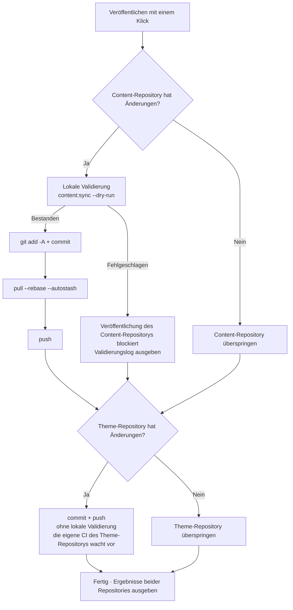

# Committen und veröffentlichen

Alle Änderungen im Admin-Panel geschehen im **lokalen Content-Repository** — damit sie auf dem Online-Blog erscheinen, braucht es git-Commit und Push. Die Seite „Committen und veröffentlichen“ macht daraus eine Ein-Klick-Operation und legt noch Sicherheitsprüfungen vor die Veröffentlichung.

## Seitenlayout

- **Linke Spalte**: Eingabe der Commit-Nachrichten, Repository-Status, letzte Commits, Ausgabe der Ausführung
- **Rechte Spalte**: Detailtabelle der Änderungen — je Repository eine Karte, mit Badges nach Pfadtyp (Artikel/Momente/Daten/Konfiguration/Ressourcen …), Neu/Geändert-Status und Summenzeile (etwa „2 neue Artikel · 1 Moment“)

## Veröffentlichungsablauf

Nach dem Klick auf „**Mit einem Klick veröffentlichen**“ läuft für beide Repositories nacheinander (**ohne gegenseitige Blockade** — das Scheitern des einen beeinträchtigt das andere nicht):

Die wichtigsten Punkte:

- **Validierung vor jeder Veröffentlichung**: vor dem Commit des Content-Repositorys läuft `content:sync --dry-run` des Theme-Repositories (reine In-Memory-Vorabprüfung von YAML-Format, Feldschreibweisen und frontmatter-Schema); **schlägt sie fehl, wird die Veröffentlichung blockiert** — schlechte Inhalte gehen so nie online. „**Nur validieren**“ führt die Prüfung jederzeit auch einzeln aus, ohne zu veröffentlichen
- **Automatischer rebase vor dem Push**: hat das Remote neue Commits (etwa weil du an einem anderen Rechner veröffentlicht hast), holt `pull --rebase --autostash` automatisch nach — manuelles Eingreifen entfällt
- **Das Theme-Repository wird nur committet, nicht validiert**: es trägt die Synchronisierungserzeugnisse der Inhalte; über deren Qualität wacht die eigene CI des Theme-Repositories
- Nach erfolgreichem Push baut und deployt die Remote-Pipeline (GitHub Actions oder Deploy Hook) die Website automatisch

## Commit-Nachrichten

Beide Repositories haben je ein eigenes Eingabefeld — **leer lassen heißt automatisch erzeugen**:

- Das **Content-Repository** erzeugt nach den Änderungen, z. B. `feat(content): 新增文章「hello-world」`; bei reinen Änderungen alter Artikel wird auf `fix` herabgestuft, nur Momente ergeben `feat(moments): 发布动态`
- Das **Theme-Repository** ordnet nach Dateipfaden: Inhaltssynchronisierung → `chore(content)`, Ressourcen → `chore(assets)`, Skripte → `chore(cli)` …

Manuelle Eingaben müssen der Konvention `type(scope): chinesische Beschreibung` folgen (Beschreibung ≤30 Zeichen); ein falsches Format markiert das Eingabefeld rot. Sind die Nachrichten zu lang, laufen sie im schwebenden Eingabefeld als Laufband durch.

**KI-Generierung** (wenn KI aktiviert): „KI-Generierung“ erzeugt aus den Änderungen des jeweiligen Repositorys die Commit-Nachricht — die KI lernt dabei aus deinen letzten 12 Commits deinen Stil; das Ergebnis wird nur übernommen, wenn es die Formatprüfung besteht, ansonsten greift automatisch die Heuristik. **Die Veröffentlichung blockiert das nie.**

## Repository-Status und letzte Commits

Die Karte „Repository-Status“ zeigt umschaltbar Content-Repository / Theme-Repository: Branch, lokal voraus (Zahl ungestauchter Commits), Rückstand gegenüber dem Remote.

Die Schaltfläche am „Rückstand“ macht eine **Leichtgewicht-Sonde** (`git ls-remote`, zieht keinerlei Code):

- `0` — mit dem Remote im Einklang
- exakte Zahl — N Commits zurück
- „Remote hat neue Commits (Anzahl erst nach Pull bekannt)“ — die lokal zwischengespeicherte Remote-Referenz ist veraltet; der automatische rebase bei der Veröffentlichung kümmert sich darum

Die Karte „Letzte Commits“ wechselt ebenfalls zwischen beiden Repositories und zeigt je die letzten 20 (Hash, Nachricht, Datum) — nach einer Veröffentlichung sofort aktualisiert.

## Ausgabe der Ausführung

Nach Abschluss einer Veröffentlichung (oder Validierung) erscheint unten in der linken Spalte die Ausgabe: **je ein Abschnitt für【Content-Repository】und【Theme-Repository】** mit dem Ergebnis jedes Schritts; schlug die Validierung fehl, liegt das vollständige Validierungslog bei (bis auf Datei und Feld lokalisiert). Grünes „Erfolg“ / rotes „Fehlgeschlagen“ auf einen Blick; bei Teilfehlern steht klar dabei, welches Repository betroffen ist.

## Nach der Veröffentlichung

- Die gepushten Inhalte baut die Remote-Pipeline automatisch und bringt sie online — nach kurzer Zeit die Online-Website prüfen
- Die lokale [Live-Vorschau](./dashboard.md#live-vorschau) und die Website teilen sich stets dieselbe Quelle: Sah die Vorschau vor der Veröffentlichung gut aus, gibt es keine Überraschungen
- Sollte doch unerwünschter Inhalt veröffentlicht worden sein: im git-Verlauf revert genügt — jede Veröffentlichung des Content-Repositories hinterlässt saubere, nachvollziehbare Commits

## Weiter geht's

- Glückwunsch, den kompletten Arbeitsablauf von Shirone-Admin beherrschst du jetzt: [Schreiben](./post-editor.md) → [Veröffentlichen](./publish.md)
- Für Schnittstellendetails hast du die [API-Referenz](/de/api/) jederzeit zur Hand
