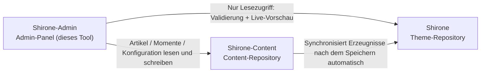

# Schnellstart

Dieses Tutorial führt dich von Null an zu einem laufenden **Shirone-Admin**: Du richtest die Blog-Arbeitsumgebung ein, die es verwaltet, startest alle Dienste und öffnest am Ende das Admin-Panel im Browser. Alle Schritte lassen sich exakt nachvollziehen — Vorkenntnisse sind keine nötig.

Nach Abschluss dieses Tutorials hast du:

- eine funktionsfähige Shirone-Blog-Arbeitsumgebung (Theme-Repository + Content-Repository + Verwaltungstool)
- ein erreichbares Admin-Panel unter `http://localhost:5173/` und einen live gerenderten Blog unter `http://localhost:4321/`

## Voraussetzungen

Stelle vor dem Start sicher, dass auf deinem Rechner Folgendes installiert ist:

| Werkzeug | Version | Prüfbefehl | Beschreibung |
|----------|---------|------------|--------------|
| Node.js | ≥ 22.12 | `node -v` | Die JavaScript-Laufzeit — Frontend und Backend von Shirone-Admin laufen darauf |
| pnpm | ≥ 9 | `pnpm -v` | Hochperformanter Node-Paketmanager, in allen drei Repositories im Einsatz |
| git | beliebige neuere Version | `git --version` | Zum Klonen der Repositories und Grundlage der späteren „Veröffentlichung mit einem Klick“ |

Falls pnpm noch fehlt, führe nach der Node.js-Installation Folgendes aus:

::: code-group

```powershell [PowerShell]
npm install -g pnpm
```

```bash [macOS / Linux]
npm install -g pnpm
```

:::

> [!NOTE]
> Shirone-Admin wird unter Windows entwickelt und getestet. In PowerShell braucht der pnpm-Aufruf die Endung `.cmd` (z. B. `pnpm.cmd install`); unter macOS / Linux genügt `pnpm` — dieser Artikel orientiert sich an PowerShell.

## Die Drei-Repository-Arbeitsumgebung verstehen

Shirone-Admin ist kein isoliertes Werkzeug: Der von ihm verwaltete Blog besteht aus **drei Repositories**, die im **selben übergeordneten Verzeichnis** liegen müssen:



- **Shirone (Theme-Repository)**: der Blog selbst — der auf Astro basierende Theme-Quellcode. Shirone-Admin greift darauf nur lesend zu, für die Validierung vor der Veröffentlichung und die Live-Vorschau
- **Shirone-Content (Content-Repository)**: hier liegen deine Artikel, Momente, Daten und Konfigurationen — es ist das **einzige Schreibziel** von Shirone-Admin
- **Shirone-Admin (dieses Tool)**: das Verwaltungstool mit getrenntem Frontend und Backend, das das manuelle Bearbeiten der Content-Repository-Dateien ablöst

Ohne jegliche konfigurierte Umgebungsvariable findet Shirone-Admin die anderen beiden Repositories automatisch über die relativen Positionen aus der Grafik — deshalb müssen alle drei im selben Verzeichnis liegen.

## Schritt 1: Die drei Repositories klonen

Wähle ein übergeordnetes Verzeichnis (im Folgenden `blogs_ws`) und klone nacheinander:

```powershell
mkdir blogs_ws
cd blogs_ws

git clone https://github.com/LyraVoid/Shirone.git
git clone https://github.com/LyraVoid/Shirone-Content.git
git clone https://github.com/bobokaka/Shirone-Admin.git
```

> [!TIP]
> Falls du bereits ein eigenes Content-Repository hast (Fork oder selbst erstellt), ersetze einfach die Adresse im zweiten clone-Befehl durch deine. Shirone-Admin schreibt immer in die lokale Kopie deines Content-Repositories.

Danach sollte die Verzeichnisstruktur so aussehen:

```
blogs_ws/
├── Shirone/           # Blog-Theme
├── Shirone-Content/   # Content-Repository
└── Shirone-Admin/     # Verwaltungstool
```

## Schritt 2: Abhängigkeiten installieren

Zwei Repositories brauchen ihre Abhängigkeiten: Shirone-Admin selbst sowie das Shirone-Theme-Repository — die Live-Vorschau setzt auf die `node_modules` des Theme-Repositories. Für das Content-Repository ist keine Installation nötig.

```powershell
cd Shirone-Admin
pnpm.cmd install

cd ..\Shirone
pnpm.cmd install
```

> [!NOTE]
> Das Shirone-Theme nutzt Astro 7 + Svelte 5; die Abhängigkeiten sind entsprechend groß. Eine erste Installation von einigen Minuten ist normal.

## Schritt 3: Mit einem Befehl starten

Wechsle zurück ins Shirone-Admin-Verzeichnis und starte alle Dienste mit einem einzigen Befehl:

```powershell
cd ..\Shirone-Admin
node workspace/content-watch.mjs
```

Dieser eine Befehl erledigt drei Dinge gleichzeitig:

1. **Überwachung und Synchronisation des Content-Repositories** — was du im Admin-Panel speicherst, wird automatisch ins Theme-Repository für den Blog-Build synchronisiert
2. **Blog-Frontend** — startet `astro dev` im Theme-Repository auf Port `4321`
3. **Admin-Panel** — startet den API-Dienst (`5175`) und die Verwaltungsoberfläche (`5173`)

Sobald alle drei Dienste bereit sind, gibt das Terminal die Zugangsadressen aus:

```text
博客 http://localhost:4321/
Admin http://localhost:5173/
```

## Schritt 4: Das Admin-Panel öffnen

Öffne `http://localhost:5173/` im Browser — du siehst die Verwaltungsoberfläche von Shirone-Admin. Ab diesem Moment gilt:

- Was du im Admin-Panel bearbeitest, wird in Echtzeit in das lokale `Shirone-Content`-Repository geschrieben
- Unter `http://localhost:4321/` siehst du die live gerenderte Blog-Ansicht — identisch mit der Seite, die später veröffentlicht wird

Damit ist Shirone-Admin vollständig einsatzbereit.

## Häufige Anpassungen

### Repositories liegen nicht im selben Verzeichnis, oder Ports sollen geändert werden

Kopiere `.env.example` zu `.env` (im Verzeichnis `Shirone-Admin`) und passe bei Bedarf an:

```dotenv
# Absoluter Pfad des Content-Repositories (einziges Schreibziel des Admin)
CONTENT_DIR=D:\blogs\Shirone-Content

# Absoluter Pfad des Theme-Repositories (für Validierungs-Dry-Run und Live-Vorschau)
THEME_DIR=D:\blogs\Shirone

# API-Port (Standard 5175)
ADMIN_PORT=5175
```

### Nur das Admin-Panel starten

Wenn du die Blog-Vorschau nicht brauchst, kannst du den Sammelstart überspringen und nur das Admin-Werkzeug selbst laufen lassen:

```powershell
pnpm.cmd dev
```

Das startet den API-Dienst (`5175`) und die Verwaltungsoberfläche (`5173`) parallel — ohne Inhaltssynchronisation und ohne Blog-Dev-Server.

## Weiter geht's

- Architektur vertiefen: [Drei-Repository-Arbeitsbereich](./workspace.md)
- Mit dem Schreiben beginnen: [Artikelverwaltung](./posts.md) und [Artikel bearbeiten](./post-editor.md)
- Nach dem Überblick einen ersten [Veröffentlichungslauf](./publish.md) wagen
