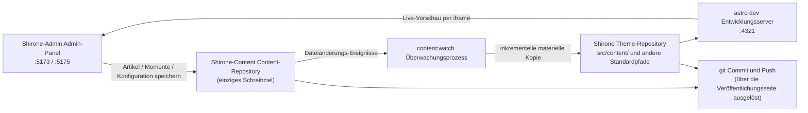

# Drei-Repository-Arbeitsbereich

Im [Schnellstart](./quick-start.md) hast du die drei Repositories in ein gemeinsames Verzeichnis geklont. Dieses Kapitel erklärt vertieft, **warum drei Repositories**, **wo deine Inhalte am Ende landen** und **wie der Blog gebaut wird** — wer das verstanden hat, weiß bei jeder künftigen Funktion genau, wo eine Änderung ankommt.

## Die Aufgabenteilung der drei Repositories

| Repository | Rolle | Was Shirone-Admin damit macht |
|------------|-------|-------------------------------|
| **Shirone** (Theme-Repository) | Der Blog selbst: Astro-Theme-Quellcode, rendert die Inhalte zur Website | **Nur Lesezugriff** — Validierung vor der Veröffentlichung, Live-Vorschau; beim Veröffentlichen werden die bereits getrackten Synchronisierungserzeugnisse committet und gepusht |
| **Shirone-Content** (Content-Repository) | Alle deine Inhalte: Artikel, Momente, strukturierte Daten, Website-Konfiguration, Bilder | **Das einzige Schreibziel** — jedes Anlegen, Ändern und Löschen im Admin-Panel geschieht hier |
| **Shirone-Admin** (dieses Tool) | Das Admin-Panel: Vue-3-Frontend + Fastify-Backend | Speichert selbst keine Inhalte, nur die KI-Anbieterkonfiguration (`server/data/ai-settings.json`) |

> [!NOTE]
> Das Content-Repository ist privat (nicht öffentlich), Theme-Repository und Tool-Repository sind Open Source. Die Trennung von Code und Inhalt bedeutet: Du kannst deine Blog-Build-Konfiguration bedenkenlos veröffentlichen, während Artikel und persönliche Daten für immer im privaten Repository bleiben.

## Wie die Daten fließen

Nach einem Klick auf „Speichern“ im Admin-Panel durchlaufen die Daten folgende Kette:



1. **In das Content-Repository schreiben** — jeder Speichervorgang im Admin-Panel schreibt die Dateien direkt in das jeweilige Verzeichnis von `Shirone-Content`
2. **Überwachen und synchronisieren** — der `content:watch`-Prozess erkennt Änderungen im Content-Repository und kopiert die Dateien inkrementell in die Standardpfade des Theme-Repositories (dieser Schritt heißt **Materialisierung**: echte Dateikopien, keine Symlinks)
3. **Live neu bauen** — der `astro dev`-Entwicklungsserver des Theme-Repositories kompiliert neu, und die Live-Vorschau im Browser aktualisiert sich
4. **Veröffentlichen** — auf der Seite [Committen und veröffentlichen](./publish.md) werden git-Commit und Push für beide Repositories ausgeführt

> [!IMPORTANT]
> Verändere niemals direkt die Dateien unter `src/content/` im Theme-Repository — sie sind Synchronisierungserzeugnisse und werden beim nächsten Lauf von der Version im Content-Repository überschrieben. Alle Inhaltsänderungen gehören ins Admin-Panel (oder direkt ins Content-Repository).

## Ports im Überblick

| Port | Dienst | Bindung | Beschreibung |
|------|--------|---------|--------------|
| `5173` | Admin-Oberfläche | localhost | Vue-3-Frontend (Vite dev server) — genau das, was der Browser öffnet |
| `5175` | API-Dienst | **nur 127.0.0.1** | Fastify-Backend, über das alle Datenoperationen auf die Platte gehen; Präfix `/api` |
| `4321` | Blog-Frontend | localhost | `astro dev` im Theme-Repository; die Live-Vorschau-iframe zeigt hierhin |

Der API-Dienst bindet ausschließlich die Loopback-Adresse des eigenen Rechners und ist nicht im lokalen Netzwerk erreichbar — das ist die Sicherheitsgrenze dieses lokalen Einzelplatzwerkzeugs. Bleibt Port 5175 durch einen übrig gebliebenen Prozess belegt, räumt der Dienst beim Start automatisch auf und startet erneut.

## Umgebungsvariablen

Liegen die drei Repositories im selben übergeordneten Verzeichnis, ist **keine Konfiguration nötig** — Shirone-Admin lokalisiert Content- und Theme-Repository über die relativen Positionen. Liegen die Repositories getrennt oder sollen Ports geändert werden, erstelle im Verzeichnis `Shirone-Admin` eine `.env` (kopierbar aus `.env.example`):

```dotenv
# Absoluter Pfad des Content-Repositories (einziges Schreibziel des Admin)
CONTENT_DIR=D:\blogs\Shirone-Content

# Absoluter Pfad des Theme-Repositories (für Validierung vor Veröffentlichung und Live-Vorschau)
THEME_DIR=D:\blogs\Shirone

# API-Port (Standard 5175)
ADMIN_PORT=5175
```

| Variable | Standardwert | Beschreibung |
|----------|--------------|--------------|
| `CONTENT_DIR` | `../Shirone-Content` (relativ zum Tool-Repository aufgelöst) | Wurzelverzeichnis des Content-Repositories. **Verbindungsprüfung**: gilt als verbunden, wenn das Verzeichnis `content/` enthält |
| `THEME_DIR` | `../Shirone` | Wurzelverzeichnis des Theme-Repositories. **Verbindungsprüfung**: das Verzeichnis enthält `scripts/content/sync.mjs`; lokale Validierung funktioniert nur mit vorhandenem `node_modules` |
| `ADMIN_PORT` | `5175` | Port des API-Dienstes. Bewusst kein generischer Name wie `PORT`, damit die Konfiguration nicht versehentlich von anderen Tools gekapert wird |
| `DEPLOY_HOST` / `DEPLOY_REMOTE_DIR` | keine | Vom Ein-Klick-Deployment-Skript `workspace/deploy.mjs` verwendet (benötigt SSH ohne Passwort); für den Alltag irrelevant |

Änderungen an `.env` werden nach einem Neustart der Dienste wirksam.

## Verbindungsstatus prüfen

Das Badge **rechts in der oberen Leiste** des Admin-Panels zeigt den Verbindungsstatus des Content-Repositories in Echtzeit („Verbunden“/„Nicht verbunden“) — gespeist aus der Sonde von `GET /api/status`. Bei „Nicht verbunden“ der Reihe nach prüfen:

1. Stimmt der `CONTENT_DIR`-Pfad in `.env`?
2. Existiert in diesem Verzeichnis ein Unterverzeichnis `content/`? (Ein leeres Content-Repository verbindet sich ebenfalls; ohne `content/` gilt es als ungültig)

Der Verbindungsstatus des Theme-Repositories erscheint nicht in der oberen Leiste, beeinflusst aber zwei Funktionen: Ist es nicht verbunden, zeigt die Veröffentlichungsseite keine Theme-Repository-Informationen; fehlt `node_modules`, kann vor der Veröffentlichung keine lokale Validierung ausgeführt werden.

## Zwei Startarten

```powershell
# Variante 1: Sammelstart (empfohlen) — Inhaltüberwachung + Blog-Frontend + Admin-Panel im Paket
node workspace/content-watch.mjs

# Variante 2: Nur das Admin-Panel — API(:5175) + Oberfläche(:5173), ohne Inhaltssynchronisation und Blog-Frontend
pnpm.cmd dev
```

Variante 1 räumt vor dem Start übrig gebliebene Prozesse auf den Ports 4321 / 5173 / 5175 ab und startet dann nacheinander:

1. `pnpm content:watch --quiet` im Theme-Repository (Überwachung und Synchronisation des Content-Repositories)
2. `pnpm dev` im Theme-Repository (Astro dev server, :4321)
3. `pnpm dev` in Shirone-Admin (server + client parallel)

Sobald alle drei Dienste per HTTP-Aktivitätsprüfung bestätigt sind, gibt das Terminal die Zugangsadressen aus. Auch ohne das Ein-Klick-Skript funktioniert die [Live-Vorschau](./dashboard.md#live-vorschau) im Admin-Panel, sobald irgendein astro-dev-Server auf Port 4321 läuft — das Vorschau-Panel untersucht nur den Port und interessiert sich nicht dafür, welcher Prozess ihn gestartet hat.

## Was im Content-Repository liegt

Die Kenntnis der Verzeichniszwecke hilft bei der Fehlersuche und bei manuellen Backups:

```
Shirone-Content/
├── content/
│   ├── posts/          # Artikel: <slug>/index.md (verzeichnisbasiert) oder flach *.md
│   │   └── hello/
│   │       ├── index.md
│   │       └── images/ # Bilder dieses Artikels
│   └── moments/        # Momente: <yyyymmdd-HHmmss>.md
├── config/             # Website-Konfiguration als YAML (site/profile/nav-bar/footer)
│   └── footer.html     # eigenes HTML für die Fußzeile
├── data/               # strukturierte Daten (projects/skills/timeline/… 8 Typen *.ts)
├── assets/             # Bilder, die bei der Erstellung komprimiert und umkodiert werden (Banner, Avatar u. a.)
└── public/             # unverändert veröffentlichte Ressourcen (Momente-Bilder, Musik, Anime-Cover u. a.)
```

Drei dieser Bereiche sind **zur Build-Zeit abgeleitete Ressourcen und dürfen nicht verändert werden** (sie verwaltet das Build-Skript des Themes; manuelle Eingriffe zerstören den Build):

- `public/assets/moments/thumbnails/**` — Vorschaubilder der Momente
- `public/assets/anime/covers/**` — Cover-Cache für Anime
- die Font-Subset-Verzeichnisse (`**/.subset/**`)

## Weiter geht's

- Zurück zum [Dashboard](./dashboard.md), um jeden Bereich des Admin-Panels kennenzulernen
- Oder direkt den [ersten Artikel schreiben](./posts.md)
