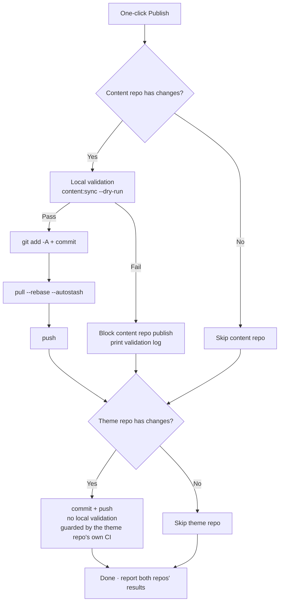

# Commit & Publish

Every change made in the admin console lives in the **local content repository**; to make it appear on the live blog, it needs a git commit and push. The "Commit & Publish (“提交和发布”)" page turns this into a one-click operation, with pre-publish safety checks attached.

## Page Layout

- **Left column**: commit message inputs, repository status, recent commits, execution output
- **Right column**: the change detail table—each of the two repositories gets a card, with entries tagged by path type (posts/Moments/data/config/assets…), new/modified state, and a summary row (e.g. “2 篇新文章 · 1 条说说”)

## Publishing Flow

After you click "**One-click Publish (“一键发布”)**", the two repositories are processed in sequence (**never blocking each other**—one failing does not affect the other):

A few key points:

- **Mandatory pre-publish validation**: before the content repository commits, the theme repository's `content:sync --dry-run` runs (an in-memory preflight of YAML format, field spelling, and frontmatter schema); **a validation failure blocks the release outright**, so bad content never goes live. You can click "**Validate Only (“仅校验”)**" at any time to run it alone without publishing
- **Automatic rebase before push**: when the remote has new commits (say you published from another machine), `pull --rebase --autostash` catches up automatically—no manual handling needed
- **The theme repository commits without validation**: what it carries is the materialized output of content sync; quality is guarded by the theme repository's own CI
- After a successful push, the remote build pipeline (GitHub Actions or a Deploy Hook) builds and deploys the site automatically

## Commit Messages

Each repository has its own input box; **leave it empty to auto-generate**:

- **Content repository**: generated from the changes, e.g. `feat(content): 新增文章「hello-world」`; downgraded to `fix` when only existing posts are edited, and `feat(moments): 发布动态` when only Moments are published
- **Theme repository**: classified by file path: content sync → `chore(content)`, assets → `chore(assets)`, scripts → `chore(cli)`…

Manual input must follow the convention `type(scope): description` (description ≤30 characters); a malformed format turns the input box red. Overly long messages marquee-scroll when the box is hovered.

**AI generation** (when AI is enabled): click "AI Generate (“AI生成”)" to generate the commit message from this repository's changes—the AI studies your recent 12 commits to learn your style; its output is adopted only after passing format validation, otherwise it automatically falls back to heuristic generation, **never blocking the publish**.

## Repository Status and Recent Commits

The "Repository Status (“仓库状态”)" card toggles between content repository / theme repository, showing: branch, local ahead (unpushed commits), and behind remote.

The refresh button next to "Behind Remote" performs a **lightweight probe** (`git ls-remote`, pulling no code):

- `0`—in sync with the remote
- An exact number—N commits behind
- “Remote has new commits (count unknown until pulled)”—the locally cached remote ref is stale; the automatic rebase during publishing takes care of it

The "Recent Commits (“最近提交”)" card also toggles between the two repositories, showing the latest 20 each (hash, subject, date), refreshed immediately after publishing.

## Execution Output

When publishing (or validating) finishes, the bottom of the left column shows the execution output: **one section each for [Content Repository] and [Theme Repository]**, containing the result of every step; a validation failure appends the full validation log (pinpointing the exact file and field). Green "success" / red "failure" tags tell the outcome at a glance; a partial failure states clearly which repository it was.

## After Publishing

- The pushed content is built and brought live by the remote pipeline; refresh the live site a little later to verify
- The local [live site preview](./dashboard.md#live-site-preview) and the live site always share the same source—if the preview looked right before publishing, there are no surprises
- Should unwanted content ever go out: just revert it in git history—every publish in the content repository is a clear, traceable commit

## Next Steps

- Congratulations—you now command the complete Shirone-Admin workflow: [write](./post-editor.md) → [publish](./publish.md)
- For endpoint details, consult the [API Reference](/en/api/)
