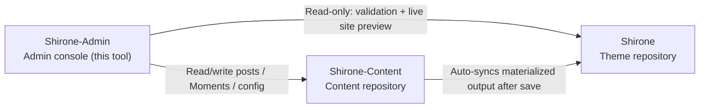

# Quick Start

This tutorial walks you through getting **Shirone-Admin** running from zero: prepare the blog workspace it manages, start all services, and finally open the admin console in your browser. Every step can be reproduced exactly as written, with no prior background required.

After finishing this tutorial, you will have:

- A working Shirone blog workspace (theme repository + content repository + management tool)
- An accessible admin console at `http://localhost:5173/` and a live-previewing blog frontend at `http://localhost:4321/`

## Prerequisites

Before starting, confirm the following are installed on your machine:

| Tool | Version Requirement | Check Command | Notes |
|------|---------------------|---------------|-------|
| Node.js | ≥ 22.12 | `node -v` | The JavaScript runtime; both the frontend and backend of Shirone-Admin run on it |
| pnpm | ≥ 9 | `pnpm -v` | High-performance Node package manager, used uniformly across all three repositories |
| git | Any recent version | `git --version` | Used to clone the repositories, and also the foundation of the later "one-click publish" |

If you do not have pnpm yet, after installing Node.js run:

::: code-group

```powershell [PowerShell]
npm install -g pnpm
```

```bash [macOS / Linux]
npm install -g pnpm
```

:::

> [!NOTE]
> Shirone-Admin is developed and verified on Windows. In PowerShell, pnpm must be invoked with the `.cmd` suffix (e.g. `pnpm.cmd install`); macOS / Linux users can use `pnpm` directly. This article uses PowerShell conventions.

## Understanding the Three-Repo Workspace

Shirone-Admin is not an isolated tool. The blog it manages consists of **three repositories** that must live under **the same parent directory**:



- **Shirone (theme repository)**: the blog itself, theme source code built on Astro. Shirone-Admin treats it as read-only, using it for pre-publish validation and live preview
- **Shirone-Content (content repository)**: your posts, Moments, data, and configuration all live here—it is the **only write target** of Shirone-Admin
- **Shirone-Admin (this tool)**: a management tool with decoupled frontend and backend, replacing manual editing of content repository files

Without any environment variables configured, Shirone-Admin automatically locates the other two repositories by their relative positions shown above—this is why the three repositories must share a directory.

## Step 1: Clone the Three Repositories

Pick any parent directory (`blogs_ws` below is an example) and clone in sequence:

```powershell
mkdir blogs_ws
cd blogs_ws

git clone https://github.com/LyraVoid/Shirone.git
git clone https://github.com/LyraVoid/Shirone-Content.git
git clone https://github.com/bobokaka/Shirone-Admin.git
```

> [!TIP]
> If you already have your own content repository (a fork or self-built), simply replace the repository URL in the second clone command. Shirone-Admin always writes to this local copy of the content repository.

When finished, the directory structure should look like:

```
blogs_ws/
├── Shirone/           # Blog theme
├── Shirone-Content/   # Content repository
└── Shirone-Admin/     # Management tool
```

## Step 2: Install Dependencies

Two repositories need dependencies installed: Shirone-Admin itself, and the Shirone theme repository—the live site preview depends on the theme repository's `node_modules`. The content repository needs no installation.

```powershell
cd Shirone-Admin
pnpm.cmd install

cd ..\Shirone
pnpm.cmd install
```

> [!NOTE]
> The Shirone theme uses Astro 7 + Svelte 5 with a large dependency tree. A first install taking a few minutes is normal.

## Step 3: One-Command Startup

Return to the Shirone-Admin directory and run a single command to start all services:

```powershell
cd ..\Shirone-Admin
node workspace/content-watch.mjs
```

This one command accomplishes three things simultaneously:

1. **Content repository watch & sync**—after you save content in the admin console, it is automatically synced to the theme repository for blog builds
2. **Blog frontend**—starts the theme repository's `astro dev` on port `4321`
3. **Admin console**—starts the API service (`5175`) and the management UI (`5173`)

Once all three are ready, the terminal prints the access addresses together:

```text
博客 http://localhost:4321/
Admin http://localhost:5173/
```

## Step 4: Open the Admin Console

Visit `http://localhost:5173/` in your browser to see the Shirone-Admin management UI. At this point:

- Content edited in the console is written in real time to your local `Shirone-Content` repository
- Opening `http://localhost:4321/` shows the blog frontend rendering live—identical to what the published site will look like

Shirone-Admin is now fully ready.

## Common Adjustments

### Repositories Not Under the Same Parent Directory, or Changing Ports

Copy `.env.example` to `.env` (placed in the `Shirone-Admin` directory) and adjust as needed:

```dotenv
# Absolute path of the content repository (admin's sole write target)
CONTENT_DIR=D:\blogs\Shirone-Content

# Absolute path of the theme repository (for validation dry-run and live site preview)
THEME_DIR=D:\blogs\Shirone

# API port (default 5175)
ADMIN_PORT=5175
```

### Starting Only the Admin Console

When you do not need the blog frontend preview, you can skip the one-command startup and run only the Admin itself:

```powershell
pnpm.cmd dev
```

This starts the API service (`5175`) and management UI (`5173`) in parallel, without content syncing or the blog dev server.

## Next Steps

- Understand the architecture in depth: [Three-Repo Workspace](./workspace.md)
- Start writing: [Post Management](./posts.md) and [Post Editing](./post-editor.md)
- After getting the big picture, try [Commit & Publish](./publish.md) once
