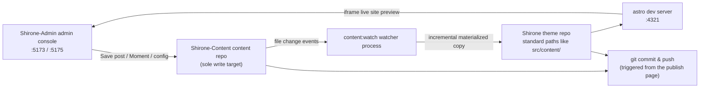

# Three-Repo Workspace

In [Quick Start](./quick-start.md) you cloned the three repositories into the same directory. This chapter takes a deeper look at **why three repositories**, **where your content actually lands**, and **how the blog gets built**—once you understand these, you will always know where your changes end up when using any feature.

## Division of Responsibilities

| Repository | Role | What Shirone-Admin Does with It |
|------------|------|---------------------------------|
| **Shirone** (theme repository) | The blog itself: Astro theme source code, responsible for rendering content into a site | **Read-only**—pre-publish validation and live site preview; on publish, its tracked sync artifacts are committed and pushed |
| **Shirone-Content** (content repository) | All your content: posts, Moments, structured data, site configuration, images | **The only write target**—every add/edit/delete in the console happens here |
| **Shirone-Admin** (this tool) | The admin console: Vue 3 frontend + Fastify backend | Stores no content itself, only the AI provider configuration (`server/data/ai-settings.json`) |

> [!NOTE]
> The "content repository" is private (not public), while the "theme repository" and "tool repository" are open source. Separating code from content means you can safely publish your blog build configuration, while posts and personal information always stay in the private repository.

## How Data Flows

After you hit "Save (“保存”)" in the console, data flows along the following path:



1. **Write to the content repository**—every save in the console writes files directly to the corresponding directory in `Shirone-Content`
2. **Watch & sync**—the `content:watch` process detects changes in the content repository and incrementally copies files to the theme repository's standard paths (this step is called **materialization**: physically copying files, not symlinking)
3. **Live build**—the theme repository's `astro dev` server recompiles, and the live site preview in your browser refreshes accordingly
4. **Publish online**—on the [Commit & Publish](./publish.md) page, git commits and pushes are executed against both repositories

> [!IMPORTANT]
> Never directly modify files under `src/content/` in the theme repository—they are sync artifacts and will be overwritten by the content repository's version on the next sync. All content changes should go through the console (or direct edits to the content repository).

## Port Overview

| Port | Service | Binding | Notes |
|------|---------|---------|-------|
| `5173` | Admin console UI | localhost | Vue 3 frontend (Vite dev server); this is what your browser opens |
| `5175` | API service | **127.0.0.1 only** | Fastify backend; all data operations persist through it; `/api` prefix |
| `4321` | Blog frontend | localhost | Theme repository's `astro dev`; the live site preview iframe points here |

The API service binds only to the local loopback address and is never exposed to the LAN—this is the security boundary of a local, single-machine tool. If port 5175 is held by a leftover instance, the service automatically cleans it up and retries at startup.

## Environment Variables

When the three repositories share a parent directory, **no configuration is needed**—Shirone-Admin locates the content repository and theme repository automatically by relative position. If the repositories live in separate locations, or you need to change ports, create a `.env` in the `Shirone-Admin` directory (you can copy from `.env.example`):

```dotenv
# Absolute path of the content repository (admin's sole write target)
CONTENT_DIR=D:\blogs\Shirone-Content

# Absolute path of the theme repository (for pre-publish validation and live site preview)
THEME_DIR=D:\blogs\Shirone

# API port (default 5175)
ADMIN_PORT=5175
```

| Variable | Default | Notes |
|----------|---------|-------|
| `CONTENT_DIR` | `../Shirone-Content` (resolved relative to this tool's repository) | Content repository root. **Connection check**: the directory contains `content/` → considered connected |
| `THEME_DIR` | `../Shirone` | Theme repository root. **Connection check**: the directory contains `scripts/content/sync.mjs`; local validation only works if `node_modules` exists |
| `ADMIN_PORT` | `5175` | API service port. Deliberately avoids generic names like `PORT` to prevent accidental hijacking by other tools' configuration |
| `DEPLOY_HOST` / `DEPLOY_REMOTE_DIR` | none | Used by the `workspace/deploy.mjs` one-click deployment script (requires passwordless SSH); irrelevant to daily use |

Restart the services after modifying `.env` for changes to take effect.

## How to Check Connection Status

The badge at the **top right of the admin console's top bar** shows the content repository connection status in real time ("Connected (“已连接”)" / "Not Connected (“未连接”)"), driven by the probe result from `GET /api/status`. When it shows "Not Connected", check in order:

1. Whether the `CONTENT_DIR` path in `.env` is correct
2. Whether that directory contains a `content/` subdirectory (an empty content repository still connects, but without `content/` it is judged invalid)

Theme repository connection status is not shown in the top bar, but it affects two features: when disconnected, the publish page shows no theme repository info; when `node_modules` is not installed, local validation cannot run before publishing.

## Two Ways to Start

```powershell
# Option 1: one-command startup (recommended) — content watcher + blog frontend + admin console
node workspace/content-watch.mjs

# Option 2: admin console only — API (:5175) + UI (:5173), without content sync or the blog frontend
pnpm.cmd dev
```

Option 1 first cleans up leftover processes on ports 4321 / 5173 / 5175, then starts in order:

1. The theme repository's `pnpm content:watch --quiet` (content repository watch & sync)
2. The theme repository's `pnpm dev` (Astro dev server, :4321)
3. Shirone-Admin's `pnpm dev` (server + client in parallel)

After all three are confirmed ready via HTTP health probes, the terminal prints the access addresses together. Even without the one-click script, as long as any Astro dev server is running on port 4321, the console's [live site preview](./dashboard.md#live-site-preview) works directly—the preview panel only probes the port and does not care which process started it.

## What Lives in the Content Repository

Knowing the purpose of each directory helps with troubleshooting and manual backups:

```
Shirone-Content/
├── content/
│   ├── posts/          # Posts: <slug>/index.md (directory style) or flat *.md
│   │   └── hello/
│   │       ├── index.md
│   │       └── images/ # images belonging to this post
│   └── moments/        # Moments: <yyyymmdd-HHmmss>.md
├── config/             # Site configuration YAML (site/profile/nav-bar/footer)
│   └── footer.html     # Custom footer HTML
├── data/               # Structured data (projects/skills/timeline/… 8 types of *.ts)
├── assets/             # Images participating in build-time compression/transcoding (banners, avatar, etc.)
└── public/             # Resources published as-is (Moment images, music, anime covers, etc.)
```

Three locations within it are **build-time derived resources and must not be modified** (managed by the theme's build scripts; manual edits break the build):

- `public/assets/moments/thumbnails/**` — Moment thumbnails
- `public/assets/anime/covers/**` — anime cover cache
- font subset directories (`**/.subset/**`)

## Next Steps

- Return to the [Dashboard](./dashboard.md) to get to know every area of the admin console
- Jump straight into [writing your first post](./posts.md)
