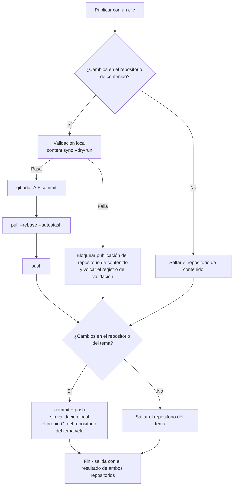

# Commit y publicación

Todos los cambios del panel ocurren en el **repositorio de contenido local**; para que aparezcan en el blog en línea hay que hacer commit y push de git. La página «Commit y publicación» convierte esto en una operación de un clic, acompañada de las comprobaciones de seguridad previas.

## Diseño de la página

- **Columna izquierda**: entrada del mensaje de commit, estado de los repositorios, commits recientes, salida de la ejecución
- **Columna derecha**: tabla de detalle de cambios — una tarjeta por repositorio, con etiquetas por tipo de ruta (artículos/momentos/datos/configuración/recursos…), estado de alta/modificación y fila de resumen (p. ej. «2 artículos nuevos · 1 momento»)

## Flujo de publicación

Al pulsar «**Publicar con un clic**», se ejecuta en orden sobre ambos repositorios (**sin bloquearse entre sí**; el fallo de uno no afecta al otro):

Puntos clave:

- **Validación obligatoria antes de publicar**: antes del commit del repositorio de contenido se ejecuta `content:sync --dry-run` del repositorio del tema (prechequeo puro en memoria de formato YAML, ortografía de campos y esquema de frontmatter); **si la validación falla, se bloquea directamente**, imposibilitando que contenido defectuoso llegue al sitio. Puedes ejecutarla suelta en cualquier momento con «**Solo validar**», sin iniciar publicación
- **Rebase automático antes del push**: si el remoto tiene commits nuevos (p. ej. publicaste desde otro ordenador), `pull --rebase --autostash` se pone al día solo, sin gestión manual
- **El repositorio del tema solo confirma, no valida**: contiene artefactos de sincronización de contenido; su calidad vela el propio CI del repositorio del tema
- Tras un push con éxito, la canalización de construcción del remoto (GitHub Actions o Deploy Hook) construye y despliega el sitio automáticamente

## Mensajes de commit

Cada repositorio tiene su caja de entrada independiente; **vacía, se genera automáticamente**:

- El **repositorio de contenido** genera según los cambios, p. ej. `feat(content): 新增文章「hello-world」`; con solo retoques de artículos antiguos degrada a `fix`, y si solo hay momentos, `feat(moments): 发布动态`
- El **repositorio del tema** clasifica por ruta de archivo: sincronización de contenido → `chore(content)`, recursos → `chore(assets)`, scripts → `chore(cli)`…

Lo escrito a mano debe cumplir la norma `type(scope): 中文描述` (descripción ≤30 caracteres); si el formato no encaja, la caja se marca en rojo con aviso. Si el mensaje es demasiado largo, al pasar el cursor la caja lo desplaza en marquesina.

**Generación con IA** (con IA activada): pulsa «Generar con IA» para crear el mensaje según los cambios de ese repositorio — la IA estudia tus últimos 12 commits para imitar tu estilo; su salida debe pasar la validación de formato para adoptarse y, si no, retrocede automáticamente a la generación heurística: **nunca bloquea la publicación**.

## Estado de los repositorios y commits recientes

La tarjeta «Estado del repositorio» alterna entre repositorio de contenido / del tema: rama, ahead local (commits sin empujar) y behind respecto al remoto.

El botón de refresco junto a «Behind remoto» hace una **sondeo ligero** (`git ls-remote`, sin bajar código alguno):

- `0` — en línea con el remoto
- Número exacto — N commits por detrás
- «El remoto tiene commits nuevos (la cifra se conoce tras tirar)» — la referencia remota cacheada localmente está caducada; el rebase automático de la publicación lo resuelve

La tarjeta «Commits recientes» también alterna entre ambos repositorios y muestra los últimos 20 de cada uno (hash, mensaje, fecha), refrescándose justo tras publicar.

## Salida de la ejecución

Al terminar la publicación (o la validación), el pie de la columna izquierda muestra la salida: **un fragmento 【Repositorio de contenido】 y otro 【Repositorio del tema】**, con el resultado de cada paso; si la validación falla, se adjunta el registro completo (localizado hasta archivo y campo concretos). Las etiquetas verde «éxito» / roja «fallo» se distinguen de un vistazo y un fallo parcial indica claramente de qué repositorio se trata.

## Después de publicar

- Lo empujado se construye y publica en línea vía la canalización remota; refresca el sitio en línea al poco para verificar
- La [vista previa del sitio real](./dashboard.md#vista-previa-del-sitio-real) local y el sitio en línea comparten siempre el mismo origen: si la vista previa estaba bien antes de publicar, no hay sorpresas
- Si publicaste algo no deseado: basta con revert en el historial git; cada publicación del repositorio de contenido deja commits claros y rastreables

## Próximos pasos

- Enhorabuena: dominas el flujo completo de Shirone-Admin — [escribir](./post-editor.md) → [publicar](./publish.md)
- Para detalles de los endpoints, consulta la [Referencia de API](/es/api/)
