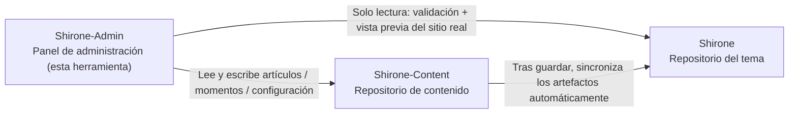

# Inicio rápido

Este tutorial te lleva desde cero hasta tener **Shirone-Admin** en marcha: preparar el espacio de trabajo del blog que administra, arrancar todos los servicios y, por último, abrir el panel de administración en el navegador. Todos los pasos son reproducibles tal cual, sin necesidad de ningún conocimiento previo.

Al terminar este tutorial tendrás:

- Un espacio de trabajo de blog Shirone funcionando (repositorio del tema + repositorio de contenido + herramienta de administración)
- El panel de administración accesible en `http://localhost:5173/` y la interfaz del blog con vista previa en vivo en `http://localhost:4321/`

## Requisitos previos

Antes de empezar, comprueba que tu equipo ya tiene instalado:

| Herramienta | Versión requerida | Comando de verificación | Nota |
|------|----------|----------|------|
| Node.js | ≥ 22.12 | `node -v` | Runtime de JavaScript; tanto el frontend como el backend de Shirone-Admin se ejecutan sobre él |
| pnpm | ≥ 9 | `pnpm -v` | Gestor de paquetes de Node de alto rendimiento, usado de forma uniforme en los tres repositorios |
| git | cualquier versión reciente | `git --version` | Para clonar los repositorios; también es la base de la posterior «publicación con un clic» |

Si aún no tienes pnpm, tras instalar Node.js ejecuta:

::: code-group

```powershell [PowerShell]
npm install -g pnpm
```

```bash [macOS / Linux]
npm install -g pnpm
```

:::

> [!NOTE]
> Shirone-Admin se desarrolla y verifica en Windows. En PowerShell, pnpm se invoca con el sufijo `.cmd` (p. ej. `pnpm.cmd install`); los usuarios de macOS / Linux pueden usar `pnpm` directamente. Este artículo asume PowerShell.

## Conoce el espacio de trabajo de tres repositorios

Shirone-Admin no es una herramienta aislada: el blog que administra se compone de **tres repositorios** que deben colocarse en **el mismo directorio padre**:



- **Shirone (repositorio del tema)**: el blog en sí, código fuente del tema basado en Astro. Shirone-Admin solo lo lee, para la validación previa a publicar y la vista previa en vivo
- **Shirone-Content (repositorio de contenido)**: aquí se guardan tus artículos, momentos, datos y configuración; es **el único destino de escritura** de Shirone-Admin
- **Shirone-Admin (esta herramienta)**: herramienta de administración con frontend y backend separados, que sustituye la edición manual de los archivos del repositorio de contenido

Sin configurar ninguna variable de entorno, Shirone-Admin localiza automáticamente los otros dos repositorios por su posición relativa, como muestra el diagrama — por eso los tres deben compartir directorio.

## Paso 1: clonar los tres repositorios

Elige un directorio padre (aquí usaremos `blogs_ws` como ejemplo) y clona en orden:

```powershell
mkdir blogs_ws
cd blogs_ws

git clone https://github.com/LyraVoid/Shirone.git
git clone https://github.com/LyraVoid/Shirone-Content.git
git clone https://github.com/bobokaka/Shirone-Admin.git
```

> [!TIP]
> Si ya tienes tu propio repositorio de contenido (un fork o uno creado por ti), sustituye la URL del segundo comando de clonación por la tuya. Shirone-Admin siempre escribe en la copia local del repositorio de contenido.

Al terminar, la estructura de directorios debe quedar así:

```
blogs_ws/
├── Shirone/           # Tema del blog
├── Shirone-Content/   # Repositorio de contenido
└── Shirone-Admin/     # Herramienta de administración
```

## Paso 2: instalar dependencias

Dos repositorios necesitan dependencias: el propio Shirone-Admin y el repositorio del tema Shirone — la vista previa del sitio real depende de los `node_modules` del tema. El repositorio de contenido no necesita instalación.

```powershell
cd Shirone-Admin
pnpm.cmd install

cd ..\Shirone
pnpm.cmd install
```

> [!NOTE]
> El tema Shirone usa Astro 7 + Svelte 5; sus dependencias son voluminosas y la primera instalación tarda varios minutos. Es un comportamiento normal.

## Paso 3: iniciar todo con un comando

Vuelve al directorio de Shirone-Admin y ejecuta un único comando que arranca todos los servicios:

```powershell
cd ..\Shirone-Admin
node workspace/content-watch.mjs
```

Este único comando hace tres cosas a la vez:

1. **Escucha y sincronización del repositorio de contenido** — al guardar contenido desde el panel, se sincroniza automáticamente al repositorio del tema para la construcción del blog
2. **Interfaz del blog** — arranca el `astro dev` del repositorio del tema, puerto `4321`
3. **Panel de administración** — arranca el servicio de API (`5175`) y la interfaz de administración (`5173`)

Cuando los tres servicios están listos, el terminal imprime las direcciones de acceso:

```text
博客 http://localhost:4321/
Admin http://localhost:5173/
```

## Paso 4: abrir el panel de administración

Abre `http://localhost:5173/` en el navegador y verás la interfaz de administración de Shirone-Admin. A partir de aquí:

- El contenido editado en el panel se escribe en tiempo real en el repositorio local `Shirone-Content`
- Abriendo `http://localhost:4321/` verás el renderizado en vivo de la interfaz del blog — idéntico al sitio real que se publicará

Con esto, Shirone-Admin queda completamente listo.

## Ajustes habituales

### Los repositorios no están en el mismo directorio padre, o quieres cambiar puertos

Copia `.env.example` como `.env` (en el directorio `Shirone-Admin`) y ajusta lo que necesites:

```dotenv
# Ruta absoluta del repositorio de contenido (único destino de escritura de Admin)
CONTENT_DIR=D:\blogs\Shirone-Content

# Ruta absoluta del repositorio del tema (para la validación dry-run y la vista previa del sitio real)
THEME_DIR=D:\blogs\Shirone

# Puerto de la API (por defecto 5175)
ADMIN_PORT=5175
```

### Iniciar solo el panel de administración

Si no necesitas la vista previa del blog, puedes saltarte el arranque con un comando y ejecutar solo el Admin:

```powershell
pnpm.cmd dev
```

Esto arranca en paralelo el servicio de API (`5175`) y la interfaz de administración (`5173`), sin sincronización de contenido ni dev del blog.

## Próximos pasos

- Profundiza en la arquitectura: [Espacio de trabajo de tres repositorios](./workspace.md)
- Empieza a escribir: [Gestión de artículos](./posts.md) y [Edición de artículos](./post-editor.md)
- Cuando conozcas el conjunto, prueba un [Commit y publicación](./publish.md)
