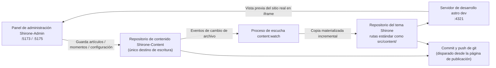

# Espacio de trabajo de tres repositorios

En el [Inicio rápido](./quick-start.md) ya clonaste los tres repositorios en un mismo directorio. Este capítulo explica en profundidad **por qué son tres repositorios**, **dónde acaba escriibiéndose tu contenido** y **cómo se construye el blog** — con eso claro, al usar cualquier función sabrás exactamente dónde caen tus cambios.

## El reparto de papeles de los tres repositorios

| Repositorio | Papel | Qué hace Shirone-Admin con él |
|------|------|--------------------------|
| **Shirone** (repositorio del tema) | El blog en sí: código fuente del tema Astro, encargado de renderizar el contenido como sitio | **Solo lectura** — validación previa y vista previa del sitio real; al publicar se hace commit y push de los artefactos sincronizados que ya seguía git |
| **Shirone-Content** (repositorio de contenido) | Todo tu contenido: artículos, momentos, datos estructurados, configuración del sitio, imágenes | **El único destino de escritura** — aquí ocurren todas las altas, bajas y modificaciones del panel |
| **Shirone-Admin** (esta herramienta) | Panel de administración: frontend Vue 3 + backend Fastify | No almacena contenido propio; solo guarda la configuración de proveedores de IA (`server/data/ai-settings.json`) |

> [!NOTE]
> El «repositorio de contenido» es privado (no público); el «repositorio del tema» y el de la herramienta son de código abierto. Separar código y contenido significa que puedes publicar sin miedo la configuración de construcción de tu blog, mientras los artículos y datos personales se quedan siempre en el repositorio privado.

## Cómo fluyen los datos

Tras pulsar «Guardar» en el panel, los datos fluyen por esta cadena:



1. **Escritura en el repositorio de contenido** — cada guardado del panel escribe los archivos directamente en los directorios correspondientes de `Shirone-Content`
2. **Escucha y sincronización** — el proceso `content:watch` detecta los cambios en el repositorio de contenido y copia incrementalmente los archivos a las rutas estándar del repositorio del tema (este paso se llama **materialización**: se copian archivos reales, no enlaces simbólicos)
3. **Construcción en tiempo real** — el servidor de desarrollo `astro dev` del repositorio del tema recompila y la vista previa del sitio real en el navegador se refresca en consecuencia
4. **Publicación** — en la página de [Commit y publicación](./publish.md) se ejecuta commit y push de git sobre ambos repositorios

> [!IMPORTANT]
> No modifiques nunca directamente los archivos bajo `src/content/` del repositorio del tema — son artefactos de sincronización y la próxima sincronización los sobrescribirá con la versión del repositorio de contenido. Todos los cambios de contenido deben hacerse desde el panel (o editando directamente el repositorio de contenido).

## Vista general de puertos

| Puerto | Servicio | Enlace | Nota |
|------|------|------|------|
| `5173` | Interfaz del panel de administración | localhost | Frontend Vue 3 (Vite dev server); es lo que abre el navegador |
| `5175` | Servicio de API | **solo 127.0.0.1** | Backend Fastify; toda operación de datos pasa por él para escribirse en disco; prefijo `/api` |
| `4321` | Interfaz del blog | localhost | `astro dev` del repositorio del tema; el iframe de vista previa del sitio real apunta aquí |

El servicio de API solo se enlaza a la interfaz de retorno local, sin exponerse a la red local — ese es el límite de seguridad de una herramienta local monousuario. Si el puerto 5175 queda ocupado por una instancia residual, el servicio la limpia automáticamente al arrancar y reintenta.

## Variables de entorno

Con los tres repositorios en un mismo directorio padre **no hace falta ninguna configuración** — Shirone-Admin localiza automáticamente el repositorio de contenido y el del tema por su posición relativa. Si los repositorios están en ubicaciones separadas o necesitas cambiar puertos, crea un archivo `.env` en el directorio `Shirone-Admin` (puedes copiarlo de `.env.example`):

```dotenv
# Ruta absoluta del repositorio de contenido (único destino de escritura de Admin)
CONTENT_DIR=D:\blogs\Shirone-Content

# Ruta absoluta del repositorio del tema (para la validación previa y la vista previa del sitio real)
THEME_DIR=D:\blogs\Shirone

# Puerto de la API (por defecto 5175)
ADMIN_PORT=5175
```

| Variable | Valor por defecto | Nota |
|------|--------|------|
| `CONTENT_DIR` | `../Shirone-Content` (resuelta relativa al repositorio de la herramienta) | Directorio raíz del repositorio de contenido. **Criterio de conexión**: si existe `content/` dentro, se considera conectado |
| `THEME_DIR` | `../Shirone` | Directorio raíz del repositorio del tema. **Criterio de conexión**: si existe `scripts/content/sync.mjs`; la validación local solo puede ejecutarse si `node_modules` existe |
| `ADMIN_PORT` | `5175` | Puerto del servicio de API. A propósito no usa nombres genéricos como `PORT`, para evitar que la configuración de otras herramientas lo secuestre por accidente |
| `DEPLOY_HOST` / `DEPLOY_REMOTE_DIR` | sin valor | Los usa el script de despliegue con un clic `workspace/deploy.mjs` (requiere SSH sin contraseña); no interviene en el uso diario |

Reinicia el servicio para que los cambios en `.env` surtan efecto.

## Cómo consultar el estado de conexión

La etiqueta en la **parte superior derecha de la barra superior** del panel muestra en tiempo real el estado de conexión del repositorio de contenido («Conectado»/«No conectado»), procedente del sondeo de `GET /api/status`. Si muestra «No conectado», comprueba en orden:

1. Que la ruta de `CONTENT_DIR` en `.env` sea correcta
2. Que exista el subdirectorio `content/` en ese directorio (un repositorio de contenido vacío también conecta, pero sin `content/` se considera inválido)

El estado del repositorio del tema no se muestra en la barra superior, pero afecta a dos funciones: si no está conectado, la página de publicación no muestra la información del repositorio del tema; si `node_modules` no está instalado, no se puede ejecutar la validación local antes de publicar.

## Dos formas de arranque

```powershell
# Forma 1: arranque con un comando (recomendado) — trío de escucha de contenido + interfaz del blog + panel de administración
node workspace/content-watch.mjs

# Forma 2: iniciar solo el panel de administración — API(:5175) + interfaz(:5173), sin sincronización de contenido ni interfaz del blog
pnpm.cmd dev
```

Al arrancar con la forma 1, primero se limpian los procesos residuales de los puertos 4321 / 5173 / 5175 y después se levantan en secuencia:

1. `pnpm content:watch --quiet` del repositorio del tema (escucha y sincronización del contenido)
2. `pnpm dev` del repositorio del tema (servidor Astro dev, :4321)
3. `pnpm dev` de Shirone-Admin (server + client en paralelo)

Cuando los tres servicios confirman su disponibilidad por sondeo HTTP, el terminal imprime las direcciones de acceso. Incluso sin usar el script de arranque único, siempre que haya un Astro dev server de cualquier origen corriendo en el puerto 4321, la [vista previa del sitio real](./dashboard.md#vista-previa-del-sitio-real) del panel funciona directamente — el panel de vista previa solo sondea el puerto, no le importa quién arrancó el proceso.

## Qué hay dentro del repositorio de contenido

Conocer el propósito de cada directorio sirve para diagnosticar problemas y hacer copias de seguridad manuales:

```
Shirone-Content/
├── content/
│   ├── posts/          # Artículos: <slug>/index.md (en directorio) o *.md planos
│   │   └── hello/
│   │       ├── index.md
│   │       └── images/ # Imágenes de ese artículo
│   └── moments/        # Momentos: <yyyymmdd-HHmmss>.md
├── config/             # Configuración YAML del sitio (site/profile/nav-bar/footer)
│   └── footer.html     # HTML personalizado del pie de página
├── data/               # Datos estructurados (projects/skills/timeline/… 8 tipos de *.ts)
├── assets/             # Imágenes que participan en la compresión/conversión de la construcción (banner, avatar, etc.)
└── public/             # Recursos publicados tal cual (imágenes de momentos, música, portadas de animes, etc.)
```

Tres ubicaciones son **recursos derivados en tiempo de construcción y no deben tocarse** (los gestiona el script de construcción del tema; modificarlas a mano rompe la construcción):

- `public/assets/moments/thumbnails/**` — miniaturas de momentos
- `public/assets/anime/covers/**` — caché de portadas de animes
- los directorios de subconjuntos de fuentes (`**/.subset/**`)

## Próximos pasos

- Vuelve al [panel de control](./dashboard.md) para conocer cada zona del panel de administración
- O empieza directamente a [escribir tu primer artículo](./posts.md)
