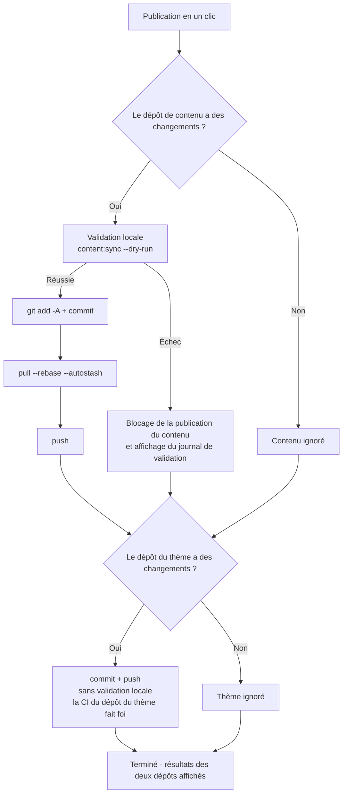

# Commit et publication

Toutes les modifications de l'administration se produisent dans le **dépôt de contenu local** ; pour les voir sur le blog en ligne, il faut commiter et pousser via git. La page « Commit et publication » en fait une opération en un clic, agrémentée de contrôles de sécurité avant publication.

## Mise en page de la page

- **Colonne de gauche** : saisie des messages de commit, état des dépôts, commits récents, sortie d'exécution
- **Colonne de droite** : le tableau des modifications — une carte par dépôt, avec étiquettes par type de chemin (articles / moments / données / réglages / ressources…), statut nouveau/modifié et ligne de résumé (ex. « 2 nouveaux articles · 1 moment »)

## Flux de publication

Après le clic sur « **Publication en un clic** », les deux dépôts sont traités successivement (**sans blocage croisé**, l'échec de l'un n'affecte pas l'autre) :

Quelques points clés :

- **Validation forcée avant publication** : avant le commit du dépôt de contenu, le `content:sync --dry-run` du dépôt du thème s'exécute (précontrôle purement en mémoire des formats YAML, des coquilles de champs et du schéma frontmatter) ; **un échec bloque net**, interdisant tout contenu défectueux en ligne. « **Valider seulement** » l'exécute isolément à tout moment, sans lancer de publication
- **Rebase automatique avant push** : si le distant a de nouveaux commits (une publication depuis un autre ordinateur, par exemple), le `pull --rebase --autostash` suit automatiquement, sans intervention manuelle
- **Le dépôt du thème commit sans valider** : il ne porte que des produits de synchronisation de contenu, dont la qualité est garantie par la CI du dépôt du thème lui-même
- Après un push réussi, le pipeline de construction distant (GitHub Actions ou Deploy Hook) construit et déploie le site automatiquement

## Messages de commit

Chaque dépôt a sa zone de saisie indépendante, **vide = génération automatique** :

- **Dépôt de contenu** : généré selon les modifications, ex. `feat(content): 新增文章「hello-world」` ; rétrogradé en `fix` pour la simple retouche d'un ancien article, ou `feat(moments): 发布动态` si seuls des moments sont publiés
- **Dépôt du thème** : classé par chemins de fichiers : synchronisation de contenu → `chore(content)`, ressources → `chore(assets)`, scripts → `chore(cli)`…

La saisie manuelle doit respecter le format `type(scope): 中文描述` (description ≤ 30 caractères) ; un format incorrect marque la zone en rouge. Un message trop long défile en bandeau au survol de la zone.

**Génération IA** (IA activée) : le bouton « IA - Générer » produit un message de commit selon les modifications du dépôt — l'IA s'inspire des 12 derniers commits pour apprendre votre style, et la sortie ne sera retenue qu'en passant la validation de format, avec repli automatique sur la génération heuristique sinon : **la publication n'est jamais bloquée**.

## État des dépôts et commits récents

La carte « État du dépôt » bascule entre dépôt de contenu / dépôt du thème : branche, avance locale (commits non poussés), retard sur le distant.

Le bouton d'actualisation à côté de « retard sur le distant » fait une **sonde légère** (`git ls-remote`, sans récupérer aucun code) :

- `0` — synchronisé avec le distant
- un nombre précis — N commits de retard
- « le distant a de nouveaux commits (nombre à déterminer après récupération) » — la référence distante en cache local est périmée ; le rebase automatique de la publication s'en chargera

La carte « Commits récents » bascule de la même façon entre les deux dépôts, avec les 20 derniers chacun (hash, message, date), rafraîchis aussitôt après publication.

## Sortie d'exécution

Une fois la publication (ou la validation) terminée, le bas de la colonne de gauche montre la sortie d'exécution : **un passage pour [dépôt de contenu] et un pour [dépôt du thème]**, avec le résultat de chaque commande ; en cas d'échec de validation, le journal complet est inclus (précisant fichier et champ en cause). Les étiquettes « succès » en vert / « échec » en rouge se lisent d'un coup d'œil, et un échec partiel indique clairement quel dépôt est concerné.

## Après la publication

- Le contenu poussé est construit et mis en ligne par le pipeline distant ; rafraîchissez le site en ligne un peu plus tard pour vérifier
- L'[aperçu du site réel](./dashboard.md#apercu-du-site-reel) local et le site en ligne partagent la même source : un aperçu sans défaut avant publication, c'est un site sans surprise
- Au cas où un contenu indésirable serait publié : un revert dans l'historique git suffit, chaque publication du dépôt de contenu laissant un commit clairement traçable

## Prochaines étapes

- Félicitations, vous maîtrisez le flux complet de Shirone-Admin : [écrire](./post-editor.md) → [publier](./publish.md)
- Pour les détails des points de terminaison, consultez la [Référence API](/fr/api/)
