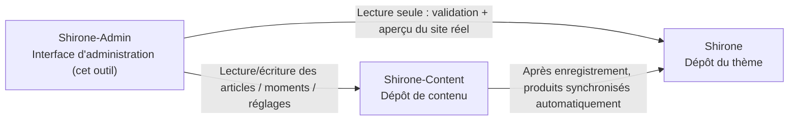

# Démarrage rapide

Ce tutoriel vous accompagne pour faire tourner **Shirone-Admin** à partir de zéro : préparer l'espace de travail du blog qu'il gère, démarrer tous les services, puis ouvrir l'interface d'administration dans votre navigateur. Toutes les étapes sont reproductibles à l'identique, sans aucun prérequis.

Au terme de ce tutoriel, vous disposerez de :

- un espace de travail de blog Shirone pleinement fonctionnel (dépôt du thème + dépôt de contenu + outil d'administration)
- une interface d'administration accessible sur `http://localhost:5173/` et un blog prévisualisé en direct sur `http://localhost:4321/`

## Prérequis

Avant de commencer, vérifiez que votre machine dispose de :

| Outil | Version requise | Commande de vérification | Rôle |
|------|----------|----------|------|
| Node.js | ≥ 22.12 | `node -v` | Runtime JavaScript, sur lequel tournent à la fois le frontend et le backend de Shirone-Admin |
| pnpm | ≥ 9 | `pnpm -v` | Gestionnaire de paquets Node haute performance, utilisé uniformément par les trois dépôts |
| git | toute version récente | `git --version` | Sert à cloner les dépôts et constitue la base de la « publication en un clic » |

Si pnpm n'est pas encore installé, exécutez ceci après avoir installé Node.js :

::: code-group

```powershell [PowerShell]
npm install -g pnpm
```

```bash [macOS / Linux]
npm install -g pnpm
```

:::

> [!NOTE]
> Shirone-Admin est développé et validé sous Windows. Dans PowerShell, l'appel de pnpm exige le suffixe `.cmd` (par ex. `pnpm.cmd install`) ; les utilisateurs de macOS / Linux peuvent appeler `pnpm` directement — ce document se réfère à PowerShell.

## Comprendre l'espace de travail à trois dépôts

Shirone-Admin n'est pas un outil isolé : le blog qu'il gère est constitué de **trois dépôts**, qui doivent se trouver dans **le même répertoire parent** :



- **Shirone (dépôt du thème)** : le blog en lui-même, code source du thème basé sur Astro. Shirone-Admin n'y accède qu'en lecture, pour la validation préalable à la publication et l'aperçu en direct
- **Shirone-Content (dépôt de contenu)** : vos articles, moments, données et réglages y résident tous — c'est la **seule cible d'écriture** de Shirone-Admin
- **Shirone-Admin (cet outil)** : outil d'administration à frontend et backend séparés, qui vous dispense d'éditer manuellement les fichiers du dépôt de contenu

Sans aucune variable d'environnement, Shirone-Admin retrouve automatiquement les deux autres dépôts d'après les positions relatives du schéma ci-dessus — voilà pourquoi les trois dépôts doivent partager le même répertoire.

## Étape 1 : cloner les trois dépôts

Choisissez un répertoire parent (ci-dessous `blogs_ws` sert d'exemple) et clonez successivement :

```powershell
mkdir blogs_ws
cd blogs_ws

git clone https://github.com/LyraVoid/Shirone.git
git clone https://github.com/LyraVoid/Shirone-Content.git
git clone https://github.com/bobokaka/Shirone-Admin.git
```

> [!TIP]
> Si vous disposez déjà de votre propre dépôt de contenu (fork ou création personnelle), remplacez simplement l'adresse de la deuxième commande de clonage par la vôtre. Shirone-Admin écrit toujours dans la copie locale du dépôt de contenu.

Une fois terminé, la structure des répertoires doit être :

```
blogs_ws/
├── Shirone/           # Thème du blog
├── Shirone-Content/   # Dépôt de contenu
└── Shirone-Admin/     # Outil d'administration
```

## Étape 2 : installer les dépendances

Deux dépôts ont besoin de leurs dépendances : Shirone-Admin lui-même, ainsi que le dépôt du thème Shirone — la prévisualisation du site réel s'appuie sur les `node_modules` du dépôt du thème. Le dépôt de contenu, lui, n'a rien à installer.

```powershell
cd Shirone-Admin
pnpm.cmd install

cd ..\Shirone
pnpm.cmd install
```

> [!NOTE]
> Le thème Shirone repose sur Astro 7 + Svelte 5 ; ses dépendances sont volumineuses et la première installation peut prendre plusieurs minutes — c'est normal.

## Étape 3 : tout lancer en une commande

Revenez dans le répertoire Shirone-Admin et démarrez tous les services avec une seule commande :

```powershell
cd ..\Shirone-Admin
node workspace/content-watch.mjs
```

Cette unique commande accomplit trois choses à la fois :

1. **Veille et synchronisation du dépôt de contenu** — quand vous enregistrez du contenu dans l'interface d'administration, il est automatiquement synchronisé vers le dépôt du thème pour la construction du blog
2. **Frontend du blog** — démarre `astro dev` du dépôt du thème, port `4321`
3. **Interface d'administration** — démarre le service API (`5175`) et l'interface (`5173`)

Une fois les trois services prêts, le terminal affiche les adresses d'accès :

```text
博客 http://localhost:4321/
Admin http://localhost:5173/
```

## Étape 4 : ouvrir l'interface d'administration

Rendez-vous sur `http://localhost:5173/` dans votre navigateur : l'interface de Shirone-Admin apparaît. À partir de là :

- tout contenu édité dans l'administration est écrit en temps réel dans le dépôt local `Shirone-Content`
- `http://localhost:4321/` montre le rendu en direct du frontend du blog — identique au futur site publié

Shirone-Admin est maintenant entièrement opérationnel.

## Réglages courants

### Les dépôts ne sont pas dans le même répertoire parent, ou changer les ports

Copiez `.env.example` en `.env` (à la racine du répertoire `Shirone-Admin`) et adaptez-le :

```dotenv
# Chemin absolu du dépôt de contenu (seule cible d'écriture de l'admin)
CONTENT_DIR=D:\blogs\Shirone-Content

# Chemin absolu du dépôt du thème (pour la validation dry-run et l'aperçu du site réel)
THEME_DIR=D:\blogs\Shirone

# Port de l'API (5175 par défaut)
ADMIN_PORT=5175
```

### Démarrer uniquement l'interface d'administration

Si la prévisualisation du blog ne vous est pas utile, vous pouvez ignorer le lancement tout-en-un et ne lancer que l'Admin lui-même :

```powershell
pnpm.cmd dev
```

Cela démarre en parallèle le service API (`5175`) et l'interface (`5173`), sans la synchronisation de contenu ni le dev du blog.

## Prochaines étapes

- Approfondir l'architecture : [L'espace de travail à trois dépôts](./workspace.md)
- Commencer à écrire : [Gestion des articles](./posts.md) et [Éditeur d'articles](./post-editor.md)
- Après avoir vu l'ensemble, essayer [Commit et publication](./publish.md)
