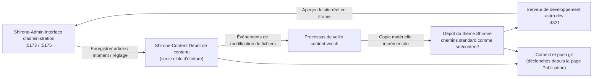

# L'espace de travail à trois dépôts

Dans le [Démarrage rapide](./quick-start.md), vous avez cloné les trois dépôts dans un même répertoire. Ce chapitre explique en profondeur **pourquoi trois dépôts**, **où finit concrètement votre contenu** et **comment le blog est construit** — une fois ces points compris, vous saurez toujours où atterrit une modification, quelle que soit la fonction utilisée.

## Le rôle de chaque dépôt

| Dépôt | Rôle | Ce que Shirone-Admin y fait |
|------|------|--------------------------|
| **Shirone** (dépôt du thème) | Le blog en soi : code source du thème Astro, chargé de rendre le contenu en site | **Lecture seule** — validation préalable à la publication, aperçu du site réel ; lors de la publication, les produits de synchronisation qu'il suit sont commités et poussés |
| **Shirone-Content** (dépôt de contenu) | Tout votre contenu : articles, moments, données structurées, réglages du site, images | **Seule cible d'écriture** — toute création, modification ou suppression de l'administration s'y produit |
| **Shirone-Admin** (cet outil) | Interface d'administration : frontend Vue 3 + backend Fastify | Ne stocke aucun contenu ; ne conserve que la configuration des fournisseurs IA (`server/data/ai-settings.json`) |

> [!NOTE]
> Le « dépôt de contenu » est un dépôt privé (non public), tandis que le « dépôt du thème » et le « dépôt de l'outil » sont open source. Séparer code et contenu signifie que vous pouvez publier sereinement la configuration de construction de votre blog, tandis que vos articles et informations personnelles restent dans le dépôt privé.

## Comment circulent les données

Après un clic sur « Enregistrer » dans l'administration, les données empruntent la chaîne suivante :



1. **Écriture dans le dépôt de contenu** — chaque enregistrement depuis l'administration écrit directement le fichier dans le bon répertoire de `Shirone-Content`
2. **Veille et synchronisation** — le processus `content:watch` détecte les changements du dépôt de contenu et copie incrémentalement les fichiers vers les chemins standard du dépôt du thème (cette étape s'appelle la **matérialisation** : une copie réelle de fichiers, pas des liens symboliques)
3. **Construction en temps réel** — le serveur de développement `astro dev` du dépôt du thème recompile, et l'aperçu du site réel se rafraîchit dans le navigateur
4. **Mise en ligne** — depuis la page [Commit et publication](./publish.md), commit et push git sont exécutés sur les deux dépôts

> [!IMPORTANT]
> Ne modifiez jamais directement les fichiers de `src/content/` dans le dépôt du thème — ce sont des produits de synchronisation, que la prochaine passe écrasera avec la version du dépôt de contenu. Toute modification de contenu doit passer par l'administration (ou directement par le dépôt de contenu).

## Vue d'ensemble des ports

| Port | Service | Liaison | Description |
|------|------|------|------|
| `5173` | Interface d'administration | localhost | Frontend Vue 3 (Vite dev server) — c'est lui que votre navigateur ouvre |
| `5175` | Service API | **127.0.0.1 uniquement** | Backend Fastify, toutes les opérations sur les données passent par lui avant d'atteindre le disque ; préfixe `/api` |
| `4321` | Frontend du blog | localhost | `astro dev` du dépôt du thème ; l'iframe d'aperçu du site réel pointe ici |

Le service API ne se lie qu'à l'adresse de boucle locale de la machine, sans exposition au réseau — c'est la frontière de sécurité d'un outil local mono-poste. Si le port 5175 est occupé par une instance résiduelle, le service la nettoie automatiquement au démarrage puis réessaie.

## Variables d'environnement

Quand les trois dépôts partagent un même répertoire parent, **aucune configuration n'est nécessaire** — Shirone-Admin localise automatiquement le dépôt de contenu et le dépôt du thème d'après leurs positions relatives. Si les dépôts sont dispersés, ou pour changer les ports, créez un fichier `.env` dans le répertoire `Shirone-Admin` (copiable depuis `.env.example`) :

```dotenv
# Chemin absolu du dépôt de contenu (seule cible d'écriture de l'admin)
CONTENT_DIR=D:\blogs\Shirone-Content

# Chemin absolu du dépôt du thème (pour la validation préalable et l'aperçu du site réel)
THEME_DIR=D:\blogs\Shirone

# Port de l'API (5175 par défaut)
ADMIN_PORT=5175
```

| Variable | Valeur par défaut | Description |
|------|--------|------|
| `CONTENT_DIR` | `../Shirone-Content` (résolue relativement au dépôt de l'outil) | Racine du dépôt de contenu. **Critère de connexion** : la présence d'un répertoire `content/` sous ce chemin vaut « connecté » |
| `THEME_DIR` | `../Shirone` | Racine du dépôt du thème. **Critère de connexion** : la présence de `scripts/content/sync.mjs` ; la validation locale n'est exécutable que si `node_modules` existe |
| `ADMIN_PORT` | `5175` | Port du service API. Le nom générique `PORT` est volontairement évité, pour ne pas être détourné par la configuration d'autres outils |
| `DEPLOY_HOST` / `DEPLOY_REMOTE_DIR` | aucune | Utilisés par le script de déploiement en un clic `workspace/deploy.mjs` (SSH sans mot de passe requis) ; sans rapport avec l'usage courant |

Redémarrez le service après avoir modifié `.env` pour que ce soit pris en compte.

## Comment consulter l'état de connexion

L'étiquette en **haut à droite de la barre supérieure** de l'administration affiche en temps réel l'état de connexion du dépôt de contenu (« Connecté » / « Non connecté »), issu de la sonde `GET /api/status`. En cas d'affichage « Non connecté », vérifiez dans l'ordre :

1. l'exactitude du chemin `CONTENT_DIR` dans `.env`
2. la présence d'un sous-répertoire `content/` sous ce chemin (un dépôt de contenu vide se connecte, mais sans `content/` il est jugé invalide)

L'état de connexion du dépôt du thème n'apparaît pas dans la barre supérieure, mais influence deux fonctions : s'il est déconnecté, la page de publication n'affiche pas les informations du dépôt du thème ; si `node_modules` n'est pas installé, la validation locale préalable à la publication est impossible.

## Deux façons de lancer

```powershell
# Façon 1 : lancement tout-en-un (recommandé) — veille de contenu + frontend du blog + administration
node workspace/content-watch.mjs

# Façon 2 : administration seule — API (:5175) + interface (:5173), sans synchronisation ni frontend de blog
pnpm.cmd dev
```

La première façon commence par nettoyer les processus résiduels sur les ports 4321 / 5173 / 5175, puis lance successivement :

1. `pnpm content:watch --quiet` du dépôt du thème (veille et synchronisation du contenu)
2. `pnpm dev` du dépôt du thème (serveur Astro dev, :4321)
3. `pnpm dev` de Shirone-Admin (server + client en parallèle)

Une fois les trois services confirmés prêts par sonde HTTP, le terminal affiche les adresses d'accès. Même sans le script tout-en-un, dès qu'un serveur Astro dev tourne sur le port 4321 — quel qu'en soit l'origine — l'[aperçu du site réel](./dashboard.md#apercu-du-site-reel) de l'administration fonctionne directement : le panneau ne sonde que le port, sans se soucier de qui a lancé le processus.

## Ce que contient le dépôt de contenu

Connaître l'usage de chaque répertoire sert au dépannage comme aux sauvegardes manuelles :

```
Shirone-Content/
├── content/
│   ├── posts/          # Articles : <slug>/index.md (en répertoire) ou *.md à plat
│   │   └── hello/
│   │       ├── index.md
│   │       └── images/ # Illustrations de cet article
│   └── moments/        # Moments : <yyyymmdd-HHmmss>.md
├── config/             # Réglages du site en YAML (site/profile/nav-bar/footer)
│   └── footer.html     # HTML personnalisé du pied de page
├── data/               # Données structurées (projects/skills/timeline/… 8 familles de *.ts)
├── assets/             # Images soumises à compression/transcodage à la construction (bannières, avatar, etc.)
└── public/             # Ressources publiées telles quelles (images de moments, musique, pochettes d'animes, etc.)
```

Trois emplacements y sont des **ressources dérivées à la construction, à ne pas modifier** (gérées par les scripts de construction du thème ; une retouche manuelle casserait la construction) :

- `public/assets/moments/thumbnails/**` — miniatures des moments
- `public/assets/anime/covers/**` — cache des pochettes d'animes
- les répertoires de sous-ensembles de polices (`**/.subset/**`)

## Prochaines étapes

- Retourner au [Tableau de bord](./dashboard.md) pour découvrir chaque zone de l'administration
- Attaquer directement [l'écriture d'un premier article](./posts.md)
