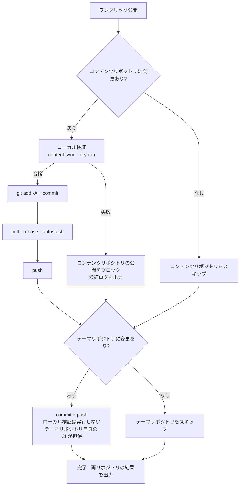

# コミットと公開

管理画面でのすべての変更は**ローカルのコンテンツリポジトリ**で行われます。オンラインのブログに反映するには、git コミットとプッシュが必要です。「コミットと公開」ページはこれをワンクリック操作にまとめ、公開前の安全チェックも添えています。

## ページレイアウト

- **左カラム**：コミットメッセージ入力、リポジトリ状態、最近のコミット、実行ログ
- **右カラム**：変更明細テーブル——2つのリポジトリそれぞれにカードがあり、パス種別ごとにラベル付け（記事/モーメンツ/データ/設定/リソース…）。追加/変更ステータスと集計行つき（例：「新規記事 2本 · モーメンツ 1件」）

## 公開フロー

「**ワンクリック公開**」を押すと、2つのリポジトリに対して順番に実行します（**互いにブロックしない**ので、片方が失敗してももう片方に影響しません）：

いくつかの要点：

- **公開前の強制検証**：コンテンツリポジトリのコミット前に、テーマリポジトリの `content:sync --dry-run` を実行します（YAML フォーマット、フィールドの綴り、frontmatter スキーマを純メモリで事前検査）。**検証失敗は公開を直接ブロック**し、壊れたコンテンツの公開を防ぎます。いつでも「**検証のみ**」をクリックして単独で実行でき、公開は行いません
- **プッシュ前の自動 rebase**：リモートに新しいコミットがあるとき（たとえば別の PC で公開した場合）、`pull --rebase --autostash` が自動で追従し、手作業は不要です
- **テーマリポジトリはコミットのみで検証なし**：ここに載るのはコンテンツの同期成果物で、品質はテーマリポジトリ自身の CI が担保します
- プッシュ成功後、リモートのビルドパイプライン（GitHub Actions または Deploy Hook）が自動でサイトを構築・デプロイします

## コミットメッセージ {#コミットメッセージ}

2つのリポジトリに独立した入力欄があり、**空欄なら自動生成**されます：

- **コンテンツリポジトリ**は変更内容に応じて生成。例：`feat(content): 新規記事「hello-world」を追加`。既存記事の修正のみなら `fix` に、モーメンツだけなら `feat(moments): モーメンツを投稿`
- **テーマリポジトリ**はファイルパスで分類：コンテンツ同期 → `chore(content)`、リソース → `chore(assets)`、スクリプト → `chore(cli)`…

手動入力は `type(scope): 説明` の規約（説明は 30文字以内）に従う必要があり、フォーマットが違えば入力欄が赤く警告します。メッセージが長い場合、入力欄にホバーするとマーキー風にスクロール表示されます。

**AI 生成**（AI 有効時）：「AI 生成」をクリックすると、このリポジトリの変更からコミットメッセージを生成します——AI は直近 12件のコミットからあなたのスタイルを学習します。出力はフォーマット検証に通らなければ採用されず、自動的にヒューリスティック生成へフォールバックします。**公開をブロックすることは決してありません**。

## リポジトリ状態と最近のコミット

「リポジトリ状態」カードはコンテンツリポジトリ / テーマリポジトリを切り替えて表示します：ブランチ、ローカルの先行（未プッシュコミット数）、リモートからの遅れ。

「リモートからの遅れ」の横の更新ボタンは**軽量 probe**（`git ls-remote`、コードは一切取得しません）を行います：

- `0`——リモートと一致
- 正確な数値——N コミット遅れている
- 「リモートに新規コミットあり（数は取得後に判明）」——ローカルキャッシュのリモート参照が古く、公開時の自動 rebase が処理します

「最近のコミット」カードも同様に 2リポジトリを切り替え、それぞれ直近 20件（ハッシュ、説明、日付）を表示し、公開後に即座に更新されます。

## 実行ログ

公開（または検証）の完了後、左カラム下部に実行ログが表示されます：**【コンテンツリポジトリ】と【テーマリポジトリ】の 2ブロック**で、各ステップのコマンド結果を含みます。検証失敗時は完全な検証ログが添付されます（問題のファイルとフィールドまで特定）。緑の「成功」/ 赤の「失敗」ラベルで一目瞭然、部分失敗の場合はどちらのリポジトリかが明示されます。

## 公開した後

- プッシュされた内容はリモートのパイプラインで自動ビルド・公開され、しばらくしてからオンラインサイトをリロードして確認します
- ローカルの[実サイトプレビュー](./dashboard.md#実サイトプレビュー)とオンラインは常に同源で、公開前にプレビューで問題なければ公開後も変わりません
- 万一、望まない内容を公開してしまった場合：git 履歴から revert するだけです。コンテンツリポジトリは公開のたびに明確で追跡可能なコミットが残ります

## 次のステップ

- おめでとうございます。Shirone-Admin の完全なワークフローを習得しました：[執筆](./post-editor.md) → [公開](./publish.md)
- インターフェースの詳細を調べたいときは [API リファレンス](/ja/api/)を参照
