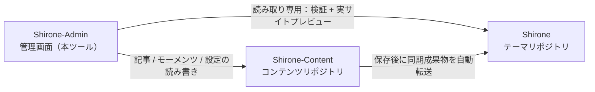

# クイックスタート

このチュートリアルでは、**Shirone-Admin** をゼロから動かします。このツールが管理するブログワークスペースを準備し、すべてのサービスを起動し、最後にブラウザーで管理画面を開きます。すべての手順はそのまま再現でき、前提知識は不要です。

このチュートリアルを終えると、次のものが手に入ります：

- 正常に動作する Shirone ブログワークスペース（テーマリポジトリ + コンテンツリポジトリ + 管理ツール）
- アクセス可能な管理画面 `http://localhost:5173/` と、リアルタイムプレビューされるブログの表画面 `http://localhost:4321/`

## 準備

始める前に、次のツールがインストール済みか確認してください：

| ツール | バージョン要件 | 確認コマンド | 説明 |
|------|----------|----------|------|
| Node.js | ≥ 22.12 | `node -v` | JavaScript ランタイム。Shirone-Admin のフロントエンドとバックエンドはどちらもその上で動きます |
| pnpm | ≥ 9 | `pnpm -v` | 高性能な Node パッケージマネージャー。3つのリポジトリで統一して使います |
| git | 比較的新しいバージョン | `git --version` | リポジトリのクローンに使うほか、後の「ワンクリック公開」の基盤にもなります |

pnpm がまだない場合は、Node.js をインストールした上で実行します：

::: code-group

```powershell [PowerShell]
npm install -g pnpm
```

```bash [macOS / Linux]
npm install -g pnpm
```

:::

> [!NOTE]
> Shirone-Admin は Windows 環境で開発・検証されています。PowerShell で pnpm を呼ぶには `.cmd` サフィックスが必要です（例：`pnpm.cmd install`）。macOS / Linux ユーザーはそのまま `pnpm` を使えばよく、本ガイドでは PowerShell 基準で記載します。

## 3リポジトリワークスペースを知る

Shirone-Admin は単独で成り立つツールではありません。このツールが管理するブログは**3つのリポジトリ**で構成され、**同じ親ディレクトリ**に置く必要があります：



- **Shirone（テーマリポジトリ）**：ブログ本体。Astro ベースのテーマソースコードです。Shirone-Admin はこれを読み取り専用として扱い、公開前検証とリアルタイムプレビューに使います
- **Shirone-Content（コンテンツリポジトリ）**：あなたの記事、モーメンツ、データ、設定がすべてここに保存されます。Shirone-Admin にとって**唯一の書き込み先**です
- **Shirone-Admin（本ツール）**：フロントエンドとバックエンドが分離した管理ツールで、コンテンツリポジトリのファイルを手動で編集する作業を代替します

環境変数を何も設定しなくても、Shirone-Admin は上図の相対位置に従ってもう 2 つのリポジトリを自動で見つけます——3つのリポジトリを同じディレクトリに置く必要があるのはこのためです。

## ステップ 1：3つのリポジトリをクローン

親ディレクトリをどこかに選び（以下では `blogs_ws` とします）、順番にクローンします：

```powershell
mkdir blogs_ws
cd blogs_ws

git clone https://github.com/LyraVoid/Shirone.git
git clone https://github.com/LyraVoid/Shirone-Content.git
git clone https://github.com/bobokaka/Shirone-Admin.git
```

> [!TIP]
> すでに自分のコンテンツリポジトリ（fork または自作）をお持ちの場合、2 番目のクローンコマンドを自分のリポジトリ URL に置き換えるだけです。Shirone-Admin が書き込むのは常にローカルのこのコンテンツリポジトリです。

完了すると、ディレクトリ構造は次のようになります：

```
blogs_ws/
├── Shirone/           # ブログテーマ
├── Shirone-Content/   # コンテンツリポジトリ
└── Shirone-Admin/     # 管理ツール
```

## ステップ 2：依存関係のインストール

2つのリポジトリに依存関係のインストールが必要です。Shirone-Admin 自身と、Shirone テーマリポジトリです——実サイトプレビュー機能はテーマリポジトリの `node_modules` に依存しています。コンテンツリポジトリのインストールは不要です。

```powershell
cd Shirone-Admin
pnpm.cmd install

cd ..\Shirone
pnpm.cmd install
```

> [!NOTE]
> Shirone テーマは Astro 7 + Svelte 5 を使用しており、依存関係のサイズが大きいため、初回インストールに数分かかるのは正常です。

## ステップ 3：ワンクリック起動

Shirone-Admin のディレクトリに戻り、コマンド 1 つですべてのサービスを起動します：

```powershell
cd ..\Shirone-Admin
node workspace/content-watch.mjs
```

この 1 コマンドで 3つのことを同時に行います：

1. **コンテンツリポジトリの監視同期**——管理画面でコンテンツを保存すると、ブログ構築用にテーマリポジトリへ自動同期します
2. **ブログ表画面**——テーマリポジトリの `astro dev` をポート `4321` で起動
3. **管理画面**——API サービス（`5175`）と管理インターフェース（`5173`）を起動

3つのサービスが揃うと、ターミナルにアクセス先の URL がまとめて表示されます：

```text
ブログ http://localhost:4321/
Admin http://localhost:5173/
```

## ステップ 4：管理画面を開く

ブラウザーで `http://localhost:5173/` にアクセスすると、Shirone-Admin の管理インターフェースが表示されます。この時点で：

- 管理画面で編集した内容は、リアルタイムにローカルの `Shirone-Content` リポジトリへ書き込まれます
- `http://localhost:4321/` を開くとブログ表画面のリアルタイム描画結果が見られます——将来公開される実際のサイトと同一です

これで Shirone-Admin は完全に動作する状態になりました。

## よくある調整

### リポジトリが同じ親ディレクトリにない、またはポートを変えたい

`.env.example` を `.env` として複製し（`Shirone-Admin` ディレクトリに置く）、必要に応じて編集します：

```dotenv
# コンテンツリポジトリの絶対パス（admin が唯一書き込む先）
CONTENT_DIR=D:\blogs\Shirone-Content

# テーマリポジトリの絶対パス（検証 dry-run と実サイトプレビュー用）
THEME_DIR=D:\blogs\Shirone

# API ポート（デフォルト 5175）
ADMIN_PORT=5175
```

### 管理画面だけ起動したい

ブログ表画面のプレビューが不要なときは、ワンクリック起動をスキップして Admin 本体だけを動かせます：

```powershell
pnpm.cmd dev
```

これは API サービス（`5175`）と管理インターフェース（`5173`）を並行起動します。コンテンツ同期とブログの dev サーバーは含みません。

## 次のステップ

- アーキテクチャを深く理解する：[3リポジトリワークスペース](./workspace.md)
- 執筆を始める：[記事管理](./posts.md)と[記事編集](./post-editor.md)
- 全体像をつかんだら一度 [コミットと公開](./publish.md)を試す
