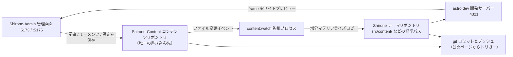

# 3リポジトリワークスペース

[クイックスタート](./quick-start.md)で、3つのリポジトリを同じディレクトリにクローンしました。この章では、**なぜ 3つのリポジトリなのか**、**あなたのコンテンツが最終的にどこに書き込まれるのか**、**ブログがどのように構築されるのか**を深く掘り下げます。これを理解すれば、どんな機能を使うときも、変更がどこに落ちたのかが明確に分かるようになります。

## 3つのリポジトリの役割分担

| リポジトリ | 役割 | Shirone-Admin はこれに何をするか |
|------|------|--------------------------|
| **Shirone**（テーマリポジトリ） | ブログ本体：Astro テーマのソースコード。コンテンツをサイトに描画する | **読み取り専用**——公開前検証、実サイトプレビュー。公開時にはこのリポジトリが追跡している同期成果物をコミットしてプッシュします |
| **Shirone-Content**（コンテンツリポジトリ） | あなたのすべてのコンテンツ：記事、モーメンツ、構造化データ、サイト設定、画像 | **唯一の書き込み先**——管理画面でのすべての追加・削除・変更はここで行われます |
| **Shirone-Admin**（本ツール） | 管理画面：Vue 3 フロントエンド + Fastify バックエンド | 自身はコンテンツを保存せず、AI プロバイダー設定のみ保持します（`server/data/ai-settings.json`） |

> [!NOTE]
> 「コンテンツリポジトリ」はプライベートリポジトリ（非公開）で、「テーマリポジトリ」と「ツールリポジトリ」はオープンソースです。コードとコンテンツが分離しているため、ブログの構築設定は安心して公開でき、記事や個人情報は永遠にプライベートリポジトリの中に留まります。

## データの流れ

管理画面で「保存」を押した後、データは次の経路を流れます：



1. **コンテンツリポジトリへ書き込み**——管理画面で保存するたび、ファイルは `Shirone-Content` の対応ディレクトリに直接書き込まれます
2. **監視同期**——`content:watch` プロセスがコンテンツリポジトリの変化を検出し、ファイルをテーマリポジトリの標準パスへ増分コピーします（このステップは**マテリアライズ（物化）**と呼ばれます：シンボリックリンクではなく、実際にファイルをコピーします）
3. **リアルタイム構築**——テーマリポジトリの `astro dev` 開発サーバーが再コンパイルし、ブラウザー内の実サイトプレビューも追従して更新されます
4. **公開**——[コミットと公開](./publish.md)ページで 2つのリポジトリに git コミットとプッシュを実行します

> [!IMPORTANT]
> テーマリポジトリの `src/content/` 配下のファイルを直接編集してはいけません——それらは同期成果物であり、次回の同期でコンテンツリポジトリのバージョンに上書きされます。コンテンツの変更はすべて管理画面経由（またはコンテンツリポジトリの直接編集）で行ってください。

## ポート一覧

| ポート | サービス | バインド | 説明 |
|------|------|------|------|
| `5173` | 管理画面インターフェース | localhost | Vue 3 フロントエンド（Vite dev server）。ブラウザーで開くのはこれです |
| `5175` | API サービス | **127.0.0.1 のみ** | Fastify バックエンド。すべてのデータ操作はこれを経由して書き込まれます。`/api` プレフィックス |
| `4321` | ブログ表画面 | localhost | テーマリポジトリの `astro dev`。実サイトプレビューの iframe はここを指します |

API サービスはホストのループバックアドレスのみにバインドし、LAN には公開されません——ローカル単体ツールとしてのセキュリティ境界です。5175 が残留インスタンスに占有されている場合、サービス起動時に自動的に整理してから再試行します。

## 環境変数

3つのリポジトリが同じ親ディレクトリにあるなら**設定は一切不要**です——Shirone-Admin が相対位置からコンテンツリポジトリとテーマリポジトリを自動で特定します。リポジトリを離れた場所に置く、またはポートを変える場合は、`Shirone-Admin` ディレクトリに `.env` を作成します（`.env.example` から複製可能）：

```dotenv
# コンテンツリポジトリの絶対パス（admin が唯一書き込む先）
CONTENT_DIR=D:\blogs\Shirone-Content

# テーマリポジトリの絶対パス（公開前検証と実サイトプレビュー用）
THEME_DIR=D:\blogs\Shirone

# API ポート（デフォルト 5175）
ADMIN_PORT=5175
```

| 変数 | デフォルト値 | 説明 |
|------|--------|------|
| `CONTENT_DIR` | `../Shirone-Content`（本ツールリポジトリから相対解決） | コンテンツリポジトリのルート。**接続判定**：その配下に `content/` が存在すれば接続済みとみなします |
| `THEME_DIR` | `../Shirone` | テーマリポジトリのルート。**接続判定**：その配下に `scripts/content/sync.mjs` が存在すること。`node_modules` があればローカル検証を実行できます |
| `ADMIN_PORT` | `5175` | API サービスのポート。`PORT` のような汎用名をあえて使わず、他ツールの設定に意図せず乗っ取られるのを防いでいます |
| `DEPLOY_HOST` / `DEPLOY_REMOTE_DIR` | なし | `workspace/deploy.mjs` のワンクリックデプロイスクリプトが使用（SSH ノンパス必要）。日常利用には関係ありません |

`.env` を変更したらサービスを再起動すると反映されます。

## 接続状態の確認方法

管理画面**トップバー右側**のラベルが、コンテンツリポジトリの接続状態（「接続済み」/「未接続」）をリアルタイム表示します。これは `GET /api/status` の probe 結果に基づきます。「未接続」と表示されたら、順番に確認してください：

1. `.env` の `CONTENT_DIR` のパスが正しいか
2. そのディレクトリ配下に `content/` サブディレクトリが存在するか（空のコンテンツリポジトリでも接続できますが、`content/` がなければ無効と判定されます）

テーマリポジトリの接続状態はトップバーには表示されませんが、2つの機能に影響します。未接続の場合、公開ページにテーマリポジトリ情報が表示されず、`node_modules` が未インストールの場合、公開前のローカル検証を実行できません。

## 2つの起動方法

```powershell
# 方法 1：ワンクリック起動（推奨）——コンテンツ監視 + ブログ表画面 + 管理画面の 3点セット
node workspace/content-watch.mjs

# 方法 2：管理画面のみ起動——API(:5175) + インターフェース(:5173)。コンテンツ同期とブログ表画面は含まず
pnpm.cmd dev
```

方法 1 は起動時に 4321 / 5173 / 5175 の 3ポートの残留プロセスを先に整理してから、順番に立ち上げます：

1. テーマリポジトリの `pnpm content:watch --quiet`（コンテンツリポジトリ監視同期）
2. テーマリポジトリの `pnpm dev`（Astro dev server、:4321）
3. Shirone-Admin の `pnpm dev`（server + client を並行起動）

3つのサービスは HTTP での死活確認で準備が整った後、ターミナルにアクセス先がまとめて表示されます。ワンクリックスクリプトを使わない場合でも、4321 ポートでどこかのソースの Astro dev server が動いていさえすれば、管理画面の[実サイトプレビュー](./dashboard.md#実サイトプレビュー)がそのまま使えます——プレビューパネルはポートだけを probe し、どのプロセスが起動したかは関知しません。

## コンテンツリポジトリの中身

各ディレクトリの用途を知っておくと、トラブルシュートや手動バックアップのときに役立ちます：

```
Shirone-Content/
├── content/
│   ├── posts/          # 記事：<slug>/index.md（ディレクトリ式）またはフラットな *.md
│   │   └── hello/
│   │       ├── index.md
│   │       └── images/ # その記事の画像
│   └── moments/        # モーメンツ：<yyyymmdd-HHmmss>.md
├── config/             # サイト設定 YAML（site/profile/nav-bar/footer）
│   └── footer.html     # フッターのカスタム HTML
├── data/               # 構造化データ（projects/skills/timeline/… 8種類の *.ts）
├── assets/             # 構築期の圧縮・変換に参加する画像（バナー、アバターなど）
└── public/             # そのまま公開されるリソース（モーメンツ画像、音楽、アニメカバーなど）
```

このうち 3箇所は**構築期に生成される派生リソースで、変更禁止**です（テーマの構築スクリプトが管理しており、手動で変えると構築が壊れます）：

- `public/assets/moments/thumbnails/**` —— モーメンツのサムネイル
- `public/assets/anime/covers/**` —— アニメカバーのキャッシュ
- 各フォントのサブセットディレクトリ（`**/.subset/**`）

## 次のステップ

- [ダッシュボード](./dashboard.md)に戻り、管理画面の各エリアを確認する
- そのまま[最初の記事を書き始める](./posts.md)
