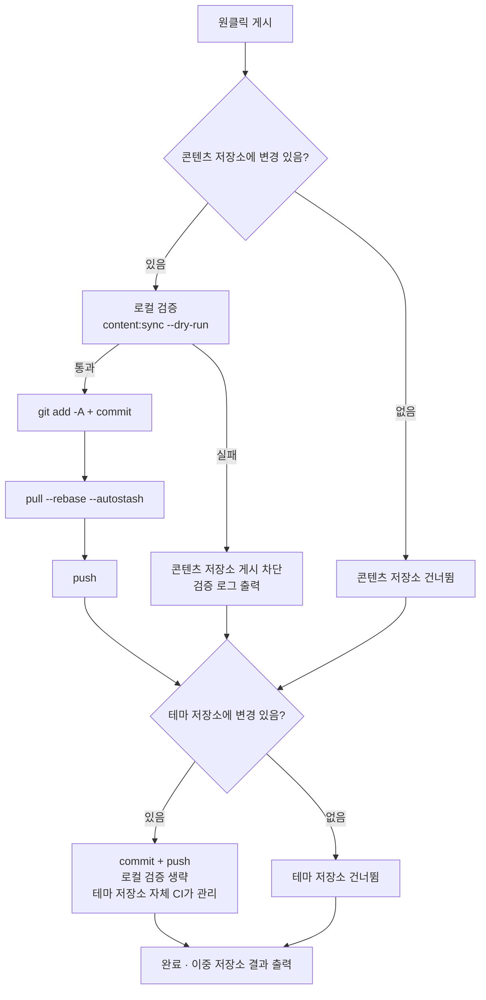

# 커밋과 게시

관리 화면에서 일어나는 모든 변경은 **로컬 콘텐츠 저장소**에 발생합니다. 이것을 온라인 블로그에 나타나게 하려면 git 커밋과 푸시가 필요합니다. 「커밋과 게시」 페이지는 이 일을 원클릭 조작으로 만들고 게시 전 안전 검사까지 곁들입니다.

## 페이지 레이아웃

- **왼쪽 칸**: 커밋 메시지 입력, 저장소 상태, 최근 커밋, 실행 출력
- **오른쪽 칸**: 변경 상세 표 — 저장소마다 한 장의 카드. 경로 유형별 배지(글/모먼트/데이터/설정/리소스…), 추가/수정 상태와 요약 행(예: 「새 글 2편 · 모먼트 1개」)

## 게시 흐름

「**원클릭 게시**」를 누르면 두 저장소에 순서대로 실행합니다(**상호 비차단**, 하나가 실패해도 다른 하나에 영향 없음):

핵심 포인트 몇 가지:

- **게시 전 강제 검증**: 콘텐츠 저장소 커밋 전에 테마 저장소의 `content:sync --dry-run`을 실행합니다(순수 메모리 사전 점검 — YAML 형식, 필드 철자, frontmatter schema). **검증 실패 시 곧바로 차단**해 잘못된 콘텐츠의 게시를 원천 차단합니다. 언제든 「**검증만**」을 눌러 단독 실행할 수 있으며 게시는 시작되지 않습니다
- **푸시 전 자동 rebase**: 원격에 새 커밋이 있을 때(예: 다른 컴퓨터에서 게시한 경우) `pull --rebase --autostash`가 자동으로 따라잡아 수동 처리가 필요 없습니다
- **테마 저장소는 커밋만 하고 검증하지 않음**: 여기에 담기는 것은 콘텐츠 동기화 산출물이며 품질은 테마 저장소 자체의 CI가 책임집니다
- 푸시 성공 후 원격의 빌드 파이프라인(GitHub Actions 또는 Deploy Hook)이 사이트를 자동 빌드·배포합니다

## 커밋 메시지 {#커밋-메시지}

두 저장소에 각각 독립된 입력란이 있으며, **비워 두면 자동 생성**됩니다:

- **콘텐츠 저장소**는 변경 내용에 맞춰 생성합니다. 예: `feat(content): 新增文章「hello-world」`. 낡은 글 수정만 있으면 `fix`로 내려가고, 모먼트만 게시하면 `feat(moments): 发布动态`입니다
- **테마 저장소**는 파일 경로에 따라 분류: 콘텐츠 동기화 → `chore(content)`, 리소스 → `chore(assets)`, 스크립트 → `chore(cli)`…

수동으로 쓸 때는 규칙 `type(scope): 中文描述`(설명 ≤30자)을 지켜야 하며, 형식이 맞지 않으면 입력란이 빨갛게 표시됩니다. 메시지가 길면 입력란 위에 마퀴(흐르는 글자)로 표시됩니다.

**AI 생성**(AI 활성화 시): 「AI 생성」을 누르면 이 저장소의 변경을 바탕으로 커밋 메시지를 만듭니다 — AI가 최근 12개 커밋을 참고해 여러분의 스타일을 학습하고, 출력은 형식 검증을 통과해야 채택되며 실패 시 휴리스틱 생성으로 자동 대체됩니다. **게시를 절대 막지 않습니다**.

## 저장소 상태와 최근 커밋

「저장소 상태」 카드는 콘텐츠 저장소 / 테마 저장소를 전환해가며 표시합니다: 브랜치, 로컬 앞섬(푸시 안 된 커밋 수), 원격보다 뒤처짐.

「원격보다 뒤처짐」 옆의 새로 고침 버튼은 **가벼운 탐지**를 합니다(`git ls-remote`, 어떤 코드도 가져오지 않음):

- `0` — 원격과 일치
- 정확한 숫자 — N개 커밋 뒤처짐
- 「원격에 새 커밋 있음(수량은 가져온 뒤 확인 가능)」 — 로컬 캐시의 원격 참조가 만료된 것으로, 게시 시 자동 rebase가 처리합니다

「최근 커밋」 카드도 마찬가지로 두 저장소를 전환하며 각각 최근 20건(해시, 설명, 날짜)을 보여 주고, 게시 직후 바로 갱신됩니다.

## 실행 출력

게시(또는 검증)가 끝나면 왼쪽 칸 하단에 실행 출력이 표시됩니다. **【콘텐츠 저장소】와【테마 저장소】 각각 한 단락**이며 단계별 명령 결과를 담습니다. 검증 실패 시 전체 검증 로그가 첨부됩니다(구체적 파일과 필드까지 위치 확인). 초록 「성공」/ 빨간 「실패」 배지로 한눈에 보이며, 부분 실패 시 어느 저장소인지 명확히 안내합니다.

## 게시 후

- 푸시된 콘텐츠는 원격 파이프라인을 거쳐 자동 빌드·게시됩니다. 잠시 후 온라인 사이트를 새로 고쳐 확인하세요
- 로컬 [실제 사이트 미리보기](./dashboard.md#실제-사이트-미리보기)와 온라인은 언제나 같은 소스이므로, 게시 전 미리보기에 문제가 없었다면 뜻밖의 일도 없습니다
- 만약 원하지 않는 내용을 게시했다면: git 기록에서 revert하면 됩니다. 콘텐츠 저장소는 게시할 때마다 명확하게 추적 가능한 커밋이 남습니다

## 다음 단계

- 축하합니다. Shirone-Admin의 완전한 워크플로를 마스터했습니다: [글쓰기](./post-editor.md) → [게시](./publish.md)
- 인터페이스 세부 사항이 필요할 때는 [API 참조](/ko/api/)를 찾아보세요
