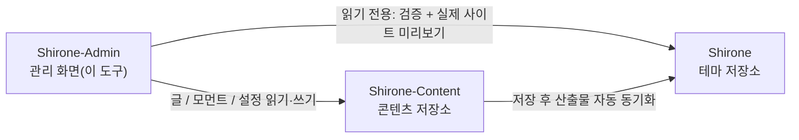

# 빠른 시작

이 튜토리얼은 **Shirone-Admin**을 제로 상태에서 실행하는 전 과정을 안내합니다. 이 도구가 관리하는 블로그 작업 공간을 준비하고, 모든 서비스를 시작하고, 마지막으로 브라우저에서 관리 화면을 엽니다. 모든 단계는 그대로 따라 하면 재현되며, 배경 지식이 전혀 필요 없습니다.

이 튜토리얼을 마치면 다음을 갖게 됩니다.

- 정상 작동하는 Shirone 블로그 작업 공간(테마 저장소 + 콘텐츠 저장소 + 관리 도구)
- 접속 가능한 관리 화면 `http://localhost:5173/`과 실시간 미리보기되는 블로그 프론트 `http://localhost:4321/`

## 준비물

시작하기 전에 아래 도구가 설치되어 있는지 확인하세요.

| 도구 | 버전 요구 | 확인 명령 | 설명 |
|------|----------|----------|------|
| Node.js | ≥ 22.12 | `node -v` | JavaScript 런타임. Shirone-Admin의 프론트엔드와 백엔드가 모두 이 위에서 동작합니다 |
| pnpm | ≥ 9 | `pnpm -v` | 고성능 Node 패키지 매니저. 세 저장소가 모두 이를 사용합니다 |
| git | 비교적 최신 버전 | `git --version` | 저장소 클론에 사용되며, 이후의「원클릭 게시」의 기반이기도 합니다 |

pnpm이 없다면 Node.js 설치 후 다음을 실행하세요.

::: code-group

```powershell [PowerShell]
npm install -g pnpm
```

```bash [macOS / Linux]
npm install -g pnpm
```

:::

> [!NOTE]
> Shirone-Admin은 Windows 환경에서 개발·검증되었습니다. PowerShell에서 pnpm을 호출할 때는 `.cmd` 접미사를 붙여야 합니다(예: `pnpm.cmd install`). macOS / Linux 사용자는 그냥 `pnpm`을 쓰면 됩니다. 본문은 PowerShell 기준으로 작성했습니다.

## 3저장소 작업 공간 이해하기

Shirone-Admin은 홀로 동작하는 도구가 아닙니다. 이 도구가 관리하는 블로그는 **세 개의 저장소**로 구성되며, 반드시 **같은 상위 디렉터리** 아래에 있어야 합니다.



- **Shirone(테마 저장소)**: 블로그 본체. Astro 기반 테마 소스입니다. Shirone-Admin은 이곳을 읽기 전용으로 사용하며, 게시 전 검증과 실시간 미리보기에 활용합니다
- **Shirone-Content(콘텐츠 저장소)**: 여러분의 글, 모먼트, 데이터, 설정이 모두 저장되는 곳으로, Shirone-Admin의 **유일한 쓰기 대상**입니다
- **Shirone-Admin(이 도구)**: 프론트엔드와 백엔드가 분리된 관리 도구로, 콘텐츠 저장소 파일을 수동으로 편집하는 수고를 대신합니다

환경 변수를 전혀 설정하지 않아도 Shirone-Admin은 위 그림의 상대 위치로 다른 두 저장소를 자동으로 찾습니다 — 세 저장소가 같은 디렉터리에 있어야 하는 이유입니다.

## 1단계: 세 저장소 클론

상위 디렉터리 하나를 정하고(아래에서는 `blogs_ws`로 가정) 순서대로 클론합니다.

```powershell
mkdir blogs_ws
cd blogs_ws

git clone https://github.com/LyraVoid/Shirone.git
git clone https://github.com/LyraVoid/Shirone-Content.git
git clone https://github.com/bobokaka/Shirone-Admin.git
```

> [!TIP]
> 이미 자신의 콘텐츠 저장소(fork 또는 자체 구축)가 있다면, 두 번째 클론 명령의 주소를 여러분의 저장소 주소로 바꾸면 됩니다. Shirone-Admin이 쓰는 것은 언제나 로컬의 이 콘텐츠 저장소입니다.

완료된 디렉터리 구조는 다음과 같아야 합니다.

```
blogs_ws/
├── Shirone/           # 블로그 테마
├── Shirone-Content/   # 콘텐츠 저장소
└── Shirone-Admin/     # 관리 도구
```

## 2단계: 의존성 설치

의존성을 설치해야 하는 저장소는 두 곳입니다. Shirone-Admin 자신과 Shirone 테마 저장소 — 실제 사이트 미리보기 기능이 테마 저장소의 `node_modules`에 의존하기 때문입니다. 콘텐츠 저장소는 설치가 필요 없습니다.

```powershell
cd Shirone-Admin
pnpm.cmd install

cd ..\Shirone
pnpm.cmd install
```

> [!NOTE]
> Shirone 테마는 Astro 7 + Svelte 5를 사용하며 의존성 용량이 커서 처음 설치에는 몇 분이 걸립니다. 정상입니다.

## 3단계: 원클릭 시작

Shirone-Admin 디렉터리로 돌아와 명령 하나로 모든 서비스를 시작합니다.

```powershell
cd ..\Shirone-Admin
node workspace/content-watch.mjs
```

이 한 줄 명령은 세 가지 일을 동시에 수행합니다.

1. **콘텐츠 저장소 감시 동기화** — 관리 화면에서 콘텐츠를 저장하면 블로그 빌드를 위해 테마 저장소로 자동 동기화됩니다
2. **블로그 프론트** — 테마 저장소의 `astro dev`를 시작합니다. 포트는 `4321`
3. **관리 화면** — API 서비스(`5175`)와 관리 인터페이스(`5173`)를 시작합니다

세 서비스가 준비되면 터미널에 접속 주소가 함께 출력됩니다.

```text
博客 http://localhost:4321/
Admin http://localhost:5173/
```

## 4단계: 관리 화면 열기

브라우저에서 `http://localhost:5173/`에 접속하면 Shirone-Admin 관리 화면이 보입니다. 이 시점에서:

- 관리 화면에서 편집한 내용은 로컬의 `Shirone-Content` 저장소에 실시간으로 기록됩니다
- `http://localhost:4321/`을 열면 블로그 프론트의 실시간 렌더링 결과를 볼 수 있습니다 — 향후 게시될 실제 사이트와 동일합니다

이것으로 Shirone-Admin이 완전히 준비되었습니다.

## 자주 하는 조정

### 저장소가 같은 상위 디렉터리에 없거나, 포트를 바꾸고 싶을 때

`.env.example`을 `.env`로 복사(`Shirone-Admin` 디렉터리 아래)하고 필요에 따라 수정합니다.

```dotenv
# 콘텐츠 저장소 절대 경로(admin의 유일한 쓰기 대상)
CONTENT_DIR=D:\blogs\Shirone-Content

# 테마 저장소 절대 경로(검증 dry-run과 실제 사이트 미리보기용)
THEME_DIR=D:\blogs\Shirone

# API 포트(기본 5175)
ADMIN_PORT=5175
```

### 관리 화면만 시작하고 싶을 때

블로그 프론트 미리보기가 필요 없다면 원클릭 시작을 건너뛰고 Admin 본체만 실행해도 됩니다.

```powershell
pnpm.cmd dev
```

이 명령은 API 서비스(`5175`)와 관리 인터페이스(`5173`)를 병렬로 시작하며, 콘텐츠 동기화와 블로그 dev는 포함하지 않습니다.

## 다음 단계

- 아키텍처 깊이 이해하기: [3저장소 작업 공간](./workspace.md)
- 글쓰기 시작하기: [글 관리](./posts.md)와 [글 편집](./post-editor.md)
- 전체 흐름을 파악한 뒤 [커밋과 게시](./publish.md) 한 번 경험해 보기
