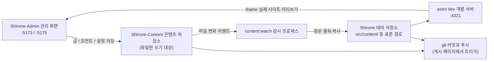

# 3저장소 작업 공간

[빠른 시작](./quick-start.md)에서 이미 세 저장소를 같은 디렉터리에 클론했습니다. 이 장에서는 **왜 세 저장소인지**, **여러분의 콘텐츠가 결국 어디에 기록되는지**, **블로그가 어떻게 빌드되는지**를 깊이 설명합니다. 이를 이해하면 이후 어떤 기능을 쓸 때든 변경이 어디에 반영되는지 명확히 알 수 있습니다.

## 세 저장소의 역할 분담

| 저장소 | 역할 | Shirone-Admin이 하는 일 |
|------|------|--------------------------|
| **Shirone**(테마 저장소) | 블로그 본체: Astro 테마 소스. 콘텐츠를 사이트로 렌더링 | **읽기 전용** — 게시 전 검증, 실제 사이트 미리보기. 게시 시 이 저장소가 추적 중인 동기화 산출물을 커밋·푸시 |
| **Shirone-Content**(콘텐츠 저장소) | 여러분의 모든 콘텐츠: 글, 모먼트, 구조화 데이터, 사이트 설정, 이미지 | **유일한 쓰기 대상** — 관리 화면의 모든 생성·수정·삭제가 이곳에서 발생 |
| **Shirone-Admin**(이 도구) | 관리 화면: Vue 3 프론트엔드 + Fastify 백엔드 | 자체적으로 콘텐츠를 저장하지 않고, AI 프로바이더 설정(`server/data/ai-settings.json`)만 보관 |

> [!NOTE]
> 「콘텐츠 저장소」는 비공개 저장소이고, 「테마 저장소」와 「도구 저장소」는 오픈소스 저장소입니다. 코드와 콘텐츠가 분리되어 있으므로 블로그 빌드 설정은 안심하고 공개할 수 있고, 글과 개인 정보는 언제나 비공개 저장소에 남습니다.

## 데이터는 어떻게 흐르는가

관리 화면에서 「저장」을 누른 후 데이터는 아래 경로를 따라 흐릅니다.



1. **콘텐츠 저장소에 기록** — 관리 화면에서 저장할 때마다 파일이 `Shirone-Content`의 해당 디렉터리에 직접 기록됩니다
2. **감시 동기화** — `content:watch` 프로세스가 콘텐츠 저장소의 변화를 감지해 파일을 테마 저장소의 표준 경로로 증분 복사합니다(이 단계를 **물화**라고 합니다. 심볼릭 링크가 아니라 실제 파일을 복사하는 것)
3. **실시간 빌드** — 테마 저장소의 `astro dev` 개발 서버가 다시 컴파일하고, 브라우저의 실제 사이트 미리보기도 함께 갱신됩니다
4. **게시** — [커밋과 게시](./publish.md) 페이지에서 두 저장소에 git 커밋과 푸시를 수행합니다

> [!IMPORTANT]
> 테마 저장소의 `src/content/` 아래 파일은 절대 직접 수정하지 마세요 — 동기화 산출물이므로 다음 동기화 때 콘텐츠 저장소의 버전으로 덮어씁니다. 모든 콘텐츠 변경은 관리 화면(또는 콘텐츠 저장소 직접 수정)을 통해 이루어져야 합니다.

## 포트 한눈에 보기

| 포트 | 서비스 | 바인딩 | 설명 |
|------|------|------|------|
| `5173` | 관리 화면 인터페이스 | localhost | Vue 3 프론트엔드(Vite dev server). 브라우저에서 여는 것이 바로 이것 |
| `5175` | API 서비스 | **127.0.0.1 전용** | Fastify 백엔드. 모든 데이터 조작이 이것을 거쳐 디스크에 기록됩니다. `/api` 접두사 |
| `4321` | 블로그 프론트 | localhost | 테마 저장소의 `astro dev`. 실제 사이트 미리보기 iframe이 여기를 가리킵니다 |

API 서비스는 로컬 루프백 주소에만 바인딩되어 LAN에 노출되지 않습니다 — 로컬 단독 도구의 보안 경계입니다. 5175가 잔여 인스턴스에 점유되어 있으면 서비스 시작 시 자동으로 정리한 뒤 재시도합니다.

## 환경 변수

세 저장소가 같은 상위 디렉터리에 있다면 **아무 설정도 필요 없습니다** — Shirone-Admin이 상대 위치로 콘텐츠 저장소와 테마 저장소를 자동으로 찾습니다. 저장소를 분리해 두었거나 포트를 바꿔야 할 때는 `Shirone-Admin` 디렉터리에 `.env`를 만듭니다(`.env.example`에서 복사 가능).

```dotenv
# 콘텐츠 저장소 절대 경로(admin의 유일한 쓰기 대상)
CONTENT_DIR=D:\blogs\Shirone-Content

# 테마 저장소 절대 경로(게시 전 검증과 실제 사이트 미리보기용)
THEME_DIR=D:\blogs\Shirone

# API 포트(기본 5175)
ADMIN_PORT=5175
```

| 변수 | 기본값 | 설명 |
|------|--------|------|
| `CONTENT_DIR` | `../Shirone-Content`(이 도구 저장소 기준 상대 경로로 해석) | 콘텐츠 저장소 루트. **연결 판정**: 해당 디렉터리에 `content/`가 있으면 연결된 것으로 봅니다 |
| `THEME_DIR` | `../Shirone` | 테마 저장소 루트. **연결 판정**: 해당 디렉터리에 `scripts/content/sync.mjs`가 존재해야 하며, `node_modules`가 있어야 로컬 검증을 실행할 수 있습니다 |
| `ADMIN_PORT` | `5175` | API 서비스 포트. `PORT` 같은 범용 이름을 일부러 쓰지 않아 다른 도구의 설정에 의해 뜻밖에 납치되는 일을 방지합니다 |
| `DEPLOY_HOST` / `DEPLOY_REMOTE_DIR` | 없음 | `workspace/deploy.mjs` 원클릭 배포 스크립트가 사용합니다(SSH 비밀번호 없는 접속 필요). 일상적인 사용과는 무관 |

`.env` 수정 후에는 서비스를 재시작해야 적용됩니다.

## 연결 상태 확인 방법 {#연결-상태-확인-방법}

관리 화면 **상단 바 오른쪽**의 배지가 콘텐츠 저장소 연결 상태(「연결됨」/「연결 안 됨」)를 실시간으로 표시합니다. 이 값은 `GET /api/status`의 탐지 결과입니다. 「연결 안 됨」이 표시되면 순서대로 확인하세요.

1. `.env`의 `CONTENT_DIR` 경로가 올바른지
2. 해당 디렉터리 아래에 `content/` 하위 디렉터리가 존재하는지(빈 콘텐츠 저장소도 연결할 수 있지만, `content/`가 없으면 무효로 판정)

테마 저장소 연결 상태는 상단 바에 표시되지 않지만 두 기능에 영향을 줍니다. 연결되지 않으면 게시 페이지에 테마 저장소 정보가 표시되지 않고, `node_modules`가 설치되지 않았으면 게시 전 로컬 검증을 실행할 수 없습니다.

## 두 가지 시작 방식

```powershell
# 방식 1: 원클릭 시작(권장) — 콘텐츠 감시 + 블로그 프론트 + 관리 화면 세트
node workspace/content-watch.mjs

# 방식 2: 관리 화면만 시작 — API(:5175) + 인터페이스(:5173), 콘텐츠 동기화와 블로그 프론트 제외
pnpm.cmd dev
```

방식 1은 시작 시 4321 / 5173 / 5175 세 포트의 잔여 프로세스를 먼저 정리한 뒤 차례로 띄웁니다.

1. 테마 저장소의 `pnpm content:watch --quiet`(콘텐츠 저장소 감시 동기화)
2. 테마 저장소의 `pnpm dev`(Astro dev server, :4321)
3. Shirone-Admin의 `pnpm dev`(server + client 병렬)

세 서비스는 HTTP 상태 확인으로 준비를 확정한 뒤 터미널에 접속 주소를 함께 출력합니다. 원클릭 스크립트를 쓰지 않더라도 4321 포트에 출처를 불문한 Astro dev server가 실행 중이면 관리 화면의 [실제 사이트 미리보기](./dashboard.md#실제-사이트-미리보기)를 바로 쓸 수 있습니다 — 미리보기 패널은 포트만 탐지할 뿐 프로세스를 누가 시작했는지는 상관하지 않습니다.

## 콘텐츠 저장소에는 무엇이 있나

각 디렉터리의 용도를 알아 두면 문제 해결이나 수동 백업에도 도움이 됩니다.

```
Shirone-Content/
├── content/
│   ├── posts/          # 글: <slug>/index.md(디렉터리 방식) 또는 평면형 *.md
│   │   └── hello/
│   │       ├── index.md
│   │       └── images/ # 해당 글의 첨부 이미지
│   └── moments/        # 모먼트: <yyyymmdd-HHmmss>.md
├── config/             # 사이트 설정 YAML(site/profile/nav-bar/footer)
│   └── footer.html     # 푸터 커스텀 HTML
├── data/               # 구조화 데이터(projects/skills/timeline/… 8종 *.ts)
├── assets/             # 빌드 시점 압축·변환에 참여하는 이미지(배너, 아바타 등)
└── public/             # 그대로 게시되는 리소스(모먼트 이미지, 음악, 애니메이션 표지 등)
```

이 중 세 곳은 **빌드 시점 파생 리소스로 수정 금지**입니다(테마 빌드 스크립트가 관리하며, 수동으로 고치면 빌드가 망가집니다).

- `public/assets/moments/thumbnails/**` — 모먼트 썸네일
- `public/assets/anime/covers/**` — 애니메이션 표지 캐시
- 각 폰트 서브셋 디렉터리(`**/.subset/**`)

## 다음 단계

- [대시보드](./dashboard.md)로 돌아가 관리 화면의 각 영역 살펴보기
- 바로 [첫 글 쓰기](./posts.md) 시작하기
