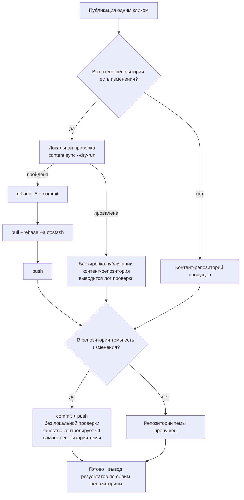

# Коммиты и публикация

Все изменения в панели происходят в **локальном контент-репозитории**; чтобы они появились в онлайн-блоге, нужен git-коммит и push. Страница «Коммиты и публикация» превращает это в операцию одним кликом и добавляет проверки безопасности перед публикацией.

## Макет страницы

- **Левая колонка**: ввод сообщений коммита, состояние репозиториев, недавние коммиты, вывод выполнения
- **Правая колонка**: таблица изменений — по карточке на каждый репозиторий, метки по типу пути (статьи/моменты/данные/конфигурация/ресурсы…), со статусами добавлен/изменён и строкой сводки (например «2 новые статьи · 1 момент»)

## Процесс публикации

После нажатия «**Опубликовать в один клик**» для обоих репозиториев по очереди выполняется (**без взаимной блокировки** — сбой одного не влияет на другой):

Несколько ключевых моментов:

- **Обязательная проверка перед публикацией**: перед коммитом контент-репозитория выполняется `content:sync --dry-run` репозитория темы (чисто в памяти: формат YAML, опечатки в полях, схема frontmatter); **провал проверки блокирует публикацию**, не пуская битый контент в онлайн. Кнопка «**Только проверка**» в любой момент запускает её отдельно, без публикации
- **Автоматический rebase перед push**: если в удалённом репозитории появились новые коммиты (например, вы публиковали с другого компьютера), `pull --rebase --autostash` подтянет их сам — вручную разбираться не нужно
- **Репозиторий темы коммитится без проверки**: в нём лежат синхронизированные артефакты контента, за их качество отвечает собственный CI репозитория темы
- После успешного push удалённый конвейер сборки (GitHub Actions или Deploy Hook) автоматически соберёт и развернёт сайт

## Сообщения коммита

У каждого репозитория своё поле ввода; **пустое поле заполняется автоматически**:

- **Контент-репозиторий** — сообщение генерируется по содержимому изменений, например `feat(content): 新增文章「hello-world」`; при правке только старых статей понижается до `fix`, а публикация одних моментов даёт `feat(moments): 发布动态`
- **Репозиторий темы** — классификация по путям файлов: синхронизация контента → `chore(content)`, ресурсы → `chore(assets)`, скрипты → `chore(cli)`…

Ручной ввод должен соответствовать формату `type(scope): 中文描述` (описание ≤30 знаков); неверный формат подсвечивает поле красным. Слишком длинное сообщение прокручивается в поле ввода «бегущей строкой».

**Генерация ИИ** (при включённом ИИ): кнопка «ИИ-генерация» создаёт сообщение по изменениям данного репозитория — ИИ изучает ваши последние 12 коммитов, перенимая стиль; вывод принимается только после прохождения форматной проверки, иначе автоматический откат к эвристике, **публикация не блокируется никогда**.

## Состояние репозиториев и недавние коммиты

Карточка «Состояние репозитория» переключается между контент-репозиторием и репозиторием темы и показывает: ветку, локальное опережение (число не отправленных коммитов), отставание от удалённого.

Кнопка обновления рядом с «отставанием» делает **лёгкий замер** (`git ls-remote`, ничего не скачивает):

- `0` — совпадает с удалённым
- Точное число — отстаёте на N коммитов
- «В удалённом есть новые коммиты (число выяснится после pull)» — локально закэшированная ссылка на удалённый репозиторий устарела; автоматический rebase при публикации это учтёт

Карточка «Недавние коммиты» тоже переключается между репозиториями и показывает последние 20 (хеш, описание, дату); после публикации обновляется немедленно.

## Вывод выполнения

После публикации (или проверки) внизу левой колонки появляется вывод выполнения: **по одному блоку [Контент-репозиторий] и [Репозиторий темы]** с результатом каждой команды; при провале проверки прикладывается полный лог (с точностью до файла и поля). Зелёная метка «Успех» / красная «Провал» видны с одного взгляда; частичный провал явно указывает, какой именно репозиторий затронут.

## После публикации

- Отправленный контент собирается и выходит в онлайн через удалённый конвейер; чуть позже обновите онлайн-сайт и убедитесь
- Локальный [предпросмотр реального сайта](./dashboard.md#предпросмотр-реального-саита) всегда един с онлайн-версией: если предпросмотр был корректен, неприятных сюрпризов не будет
- Если опубликовалось нежелательное: просто сделайте revert в git-истории — каждая публикация контент-репозитория оставляет чистый прослеживаемый коммит

## Что дальше

- Поздравляем, вы освоили полный цикл работы с Shirone-Admin: [письмо](./post-editor.md) → [публикация](./publish.md)
- За деталями интерфейсов обращайтесь к [Справочнику API](/ru/api/)
