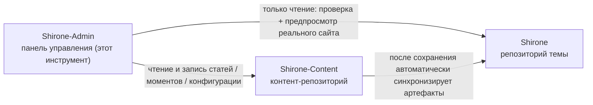

# Быстрый старт

Это руководство проведёт вас от нуля до работающего **Shirone-Admin**: подготовим рабочее пространство блога, которым он управляет, запустим все службы и в конце откроем панель управления в браузере. Все шаги воспроизводимы один в один, никаких специальных знаний не требуется.

Пройдя руководство, вы получите:

- Работающее рабочее пространство блога Shirone (репозиторий темы + контент-репозиторий + инструмент управления)
- Доступную панель управления `http://localhost:5173/` и блог с предпросмотром в реальном времени `http://localhost:4321/`

## Подготовка

Перед началом убедитесь, что на машине установлены:

| Инструмент | Версия | Команда проверки | Описание |
|------|----------|----------|------|
| Node.js | ≥ 22.12 | `node -v` | Среда выполнения JavaScript; и фронтенд, и бэкенд Shirone-Admin работают на ней |
| pnpm | ≥ 9 | `pnpm -v` | Высокопроизводительный менеджер пакетов Node; единый для всех трёх репозиториев |
| git | любая свежая | `git --version` | Для клонирования репозиториев и основа дальнейшей «публикации в один клик» |

Если pnpm ещё нет, после установки Node.js выполните:

::: code-group

```powershell [PowerShell]
npm install -g pnpm
```

```bash [macOS / Linux]
npm install -g pnpm
```

:::

> [!NOTE]
> Shirone-Admin разрабатывается и проверяется в Windows. В PowerShell вызов pnpm требует суффикса `.cmd` (например, `pnpm.cmd install`); пользователям macOS / Linux достаточно писать `pnpm` — далее в тексте приводится вариант для PowerShell.

## Знакомство с рабочим пространством из трёх репозиториев

Shirone-Admin — не изолированный инструмент: блог, которым он управляет, состоит из **трёх репозиториев**, и они должны лежать в **одной родительской директории**:



- **Shirone (репозиторий темы)** — сам блог: исходный код темы на Astro. Shirone-Admin обращается к нему только для чтения — для предпубликационной проверки и предпросмотра в реальном времени
- **Shirone-Content (контент-репозиторий)** — здесь хранятся ваши статьи, моменты, данные и конфигурация; это **единственная цель записи** для Shirone-Admin
- **Shirone-Admin (этот инструмент)** — инструмент управления с разделёнными фронтендом и бэкендом, заменяющий ручное редактирование файлов контент-репозитория

Без каких-либо переменных окружения Shirone-Admin находит два других репозитория по относительным позициям, как на схеме выше, — именно поэтому три репозитория должны лежать в одной директории.

## Шаг 1: клонируем три репозитория

Выберите любую родительскую директорию (далее для примера `blogs_ws`) и по очереди склонируйте:

```powershell
mkdir blogs_ws
cd blogs_ws

git clone https://github.com/LyraVoid/Shirone.git
git clone https://github.com/LyraVoid/Shirone-Content.git
git clone https://github.com/bobokaka/Shirone-Admin.git
```

> [!TIP]
> Если у вас уже есть собственный контент-репозиторий (fork или созданный с нуля), просто замените адрес во второй команде клонирования на адрес вашего репозитория. Shirone-Admin всегда пишет в тот локальный экземпляр контент-репозитория, что лежит рядом.

После завершения структура директории должна выглядеть так:

```
blogs_ws/
├── Shirone/           # тема блога
├── Shirone-Content/   # контент-репозиторий
└── Shirone-Admin/     # инструмент управления
```

## Шаг 2: устанавливаем зависимости

Зависимости нужны двум репозиториям: самому Shirone-Admin и репозиторию темы Shirone — функция предпросмотра реального сайта опирается на `node_modules` темы. Контент-репозиторий в установке не нуждается.

```powershell
cd Shirone-Admin
pnpm.cmd install

cd ..\Shirone
pnpm.cmd install
```

> [!NOTE]
> Тема Shirone построена на Astro 7 + Svelte 5, объём зависимостей велик — первая установка занимает несколько минут, это нормально.

## Шаг 3: запуск одной командой

Вернитесь в директорию Shirone-Admin и запустите все службы одной командой:

```powershell
cd ..\Shirone-Admin
node workspace/content-watch.mjs
```

Эта единственная команда делает сразу три вещи:

1. **Отслеживающая синхронизация контент-репозитория** — после сохранения контента в панели управления он автоматически синхронизируется в репозиторий темы для сборки блога
2. **Фронтенд блога** — запускает `astro dev` из репозитория темы на порту `4321`
3. **Панель управления** — запускает API-службу (`5175`) и интерфейс управления (`5173`)

Когда все три службы готовы, терминал выводит адреса доступа:

```text
博客 http://localhost:4321/
Admin http://localhost:5173/
```

## Шаг 4: открываем панель управления

Откройте в браузере `http://localhost:5173/` — вы увидите интерфейс Shirone-Admin. Теперь:

- Контент, отредактированный в панели, в реальном времени записывается в локальный репозиторий `Shirone-Content`
- По адресу `http://localhost:4321/` видно живую отрисовку фронтенда блога — в точности тот сайт, который позже будет опубликован

На этом Shirone-Admin полностью готов к работе.

## Частые корректировки

### Репозитории не в одной родительской директории или нужно сменить порты

Скопируйте `.env.example` в `.env` (в директории `Shirone-Admin`) и при необходимости измените:

```dotenv
# Абсолютный путь к контент-репозиторию (единственная цель записи для admin)
CONTENT_DIR=D:\blogs\Shirone-Content

# Абсолютный путь к репозиторию темы (для dry-run проверки и предпросмотра реального сайта)
THEME_DIR=D:\blogs\Shirone

# Порт API (по умолчанию 5175)
ADMIN_PORT=5175
```

### Нужна только панель управления

Если предпросмотр фронтенда блога не нужен, можно пропустить запуск одной командой и запустить только сам Admin:

```powershell
pnpm.cmd dev
```

Это параллельно поднимет API-службу (`5175`) и интерфейс управления (`5173`) — без синхронизации контента и dev-сервера блога.

## Что дальше

- Разобраться в архитектуре глубже: [Рабочее пространство из трёх репозиториев](./workspace.md)
- Начать писать: [Управление статьями](./posts.md) и [Редактирование статей](./post-editor.md)
- Ознакомившись с общей картиной, попробовать [Коммиты и публикация](./publish.md)
