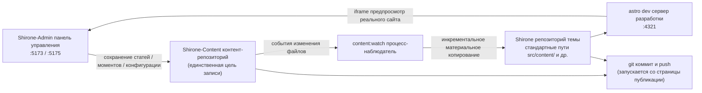

# Рабочее пространство из трёх репозиториев

В [Быстром старте](./quick-start.md) вы уже склонировали три репозитория в одну директорию. Эта глава подробно объясняет, **почему репозиториев три**, **куда в итоге попадает ваш контент** и **как собирается блог** — поняв это, при работе с любой функцией вы всегда будете знать, куда именно легли изменения.

## Роли трёх репозиториев

| Репозиторий | Роль | Что делает с ним Shirone-Admin |
|------|------|--------------------------|
| **Shirone** (репозиторий темы) | Сам блог: исходный код темы на Astro, отвечает за отрисовку контента в сайт | **Только чтение** — предпубликационная проверка, предпросмотр реального сайта; при публикации коммитит и отправляет отслеживаемые синхронизированные артефакты |
| **Shirone-Content** (контент-репозиторий) | Весь ваш контент: статьи, моменты, структурированные данные, конфигурация сайта, изображения | **Единственная цель записи** — все добавления, изменения и удаления в панели происходят здесь |
| **Shirone-Admin** (этот инструмент) | Панель управления: фронтенд на Vue 3 + бэкенд на Fastify | Сам контент не хранит, сохраняет только конфигурацию ИИ-провайдеров (`server/data/ai-settings.json`) |

> [!NOTE]
> Контент-репозиторий — приватный (не публикуется), а репозитории темы и инструмента — открытые. Разделение кода и контента означает, что вы можете спокойно публиковать конфигурацию сборки своего блога, а статьи и личные данные навсегда остаются в приватном репозитории.

## Как движутся данные

После нажатия «Сохранить» в панели данные проходят следующий путь:



1. **Запись в контент-репозиторий** — каждое сохранение в панели напрямую пишет файлы в соответствующие директории `Shirone-Content`
2. **Отслеживающая синхронизация** — процесс `content:watch` замечает изменения контент-репозитория и инкрементально копирует файлы в стандартные пути репозитория темы (этот шаг называется **материализацией**: файлы реально копируются, а не связываются символьными ссылками)
3. **Сборка в реальном времени** — dev-сервер `astro dev` репозитория темы перекомпилируется, и предпросмотр реального сайта в браузере обновляется
4. **Публикация** — на странице [Коммиты и публикация](./publish.md) выполняется git-коммит и push для обоих репозиториев

> [!IMPORTANT]
> Никогда не редактируйте напрямую файлы в `src/content/` репозитория темы — это синхронизированные артефакты, и при следующей синхронизации они будут перезаписаны версиями из контент-репозитория. Все изменения контента должны идти через панель управления (или напрямую в контент-репозиторий).

## Обзор портов

| Порт | Служба | Привязка | Описание |
|------|------|------|------|
| `5173` | Интерфейс панели управления | localhost | Фронтенд на Vue 3 (Vite dev server); именно его вы открываете в браузере |
| `5175` | API-служба | **только 127.0.0.1** | Бэкенд на Fastify; все операции с данными проходят через него; префикс `/api` |
| `4321` | Фронтенд блога | localhost | `astro dev` репозитория темы; на него указывает iframe предпросмотра реального сайта |

API-служба привязана только к петлевому адресу локальной машины и не выходит в локальную сеть — это граница безопасности локального однопользовательского инструмента. Если порт 5175 занят зависшим процессом, служба при старте автоматически подчистит его и повторит попытку.

## Переменные окружения

Когда три репозитория лежат в одной родительской директории, **настройка не нужна вообще** — Shirone-Admin находит контент-репозиторий и репозиторий темы по относительным позициям. Если репозитории разнесены или нужно сменить порты, создайте в директории `Shirone-Admin` файл `.env` (можно скопировать из `.env.example`):

```dotenv
# Абсолютный путь к контент-репозиторию (единственная цель записи для admin)
CONTENT_DIR=D:\blogs\Shirone-Content

# Абсолютный путь к репозиторию темы (для предпубликационной проверки и предпросмотра реального сайта)
THEME_DIR=D:\blogs\Shirone

# Порт API (по умолчанию 5175)
ADMIN_PORT=5175
```

| Переменная | Значение по умолчанию | Описание |
|------|--------|------|
| `CONTENT_DIR` | `../Shirone-Content` (разрешается относительно репозитория инструмента) | Корень контент-репозитория. **Признак подключения**: наличие `content/` в этой директории |
| `THEME_DIR` | `../Shirone` | Корень репозитория темы. **Признак подключения**: наличие `scripts/content/sync.mjs`; локальная проверка возможна только при установленном `node_modules` |
| `ADMIN_PORT` | `5175` | Порт API-службы. Название выбрано намеренно вместо универсального `PORT`, чтобы конфигурация других инструментов случайно не перехватила его |
| `DEPLOY_HOST` / `DEPLOY_REMOTE_DIR` | нет | Используются скриптом развертывания одной командой `workspace/deploy.mjs` (нужен SSH-доступ без пароля); к повседневной работе отношения не имеют |

Изменения `.env` вступают в силу после перезапуска службы.

## Как проверить состояние подключения

Метка справа в **верхней панели** панели управления в реальном времени показывает состояние подключения контент-репозитория («Подключено» / «Не подключено»); она берётся из результатов проверки `GET /api/status`. Если показано «Не подключено», проверьте по порядку:

1. Корректен ли путь `CONTENT_DIR` в `.env`
2. Существует ли в этой директории подкаталог `content/` (пустой контент-репозиторий тоже считается подключённым, но без `content/` он признаётся недействительным)

Состояние репозитория темы в верхней панели не отображается, но влияет на две функции: без подключения страница публикации не показывает сведения о репозитории темы; без установленного `node_modules` перед публикацией нельзя выполнить локальную проверку.

## Два способа запуска

```powershell
# Способ 1: запуск одной командой (рекомендуется) — три сразу: наблюдение контента + фронтенд блога + панель управления
node workspace/content-watch.mjs

# Способ 2: только панель управления — API(:5175) + интерфейс(:5173), без синхронизации контента и фронтенда блога
pnpm.cmd dev
```

При запуске первым способом сначала подчищаются зависшие процессы на портах 4321 / 5173 / 5175, затем по очереди поднимаются:

1. `pnpm content:watch --quiet` репозитория темы (отслеживающая синхронизация контент-репозитория)
2. `pnpm dev` репозитория темы (Astro dev server, :4321)
3. `pnpm dev` Shirone-Admin (server + client параллельно)

Когда HTTP-проверки живости подтверждают готовность всех трёх, терминал выводит адреса доступа. Даже без скрипта единого запуска — стоит на порту 4321 работать Astro dev server из любого источника, и [предпросмотр реального сайта](./dashboard.md#предпросмотр-реального-саита) в панели уже работает: панель опрашивает только порт и не интересуется, кто запустил процесс.

## Что лежит в контент-репозитории

Знание назначения директорий пригодится при диагностике проблем и ручном резервном копировании:

```
Shirone-Content/
├── content/
│   ├── posts/          # статьи: <slug>/index.md (каталогом) или плоско *.md
│   │   └── hello/
│   │       ├── index.md
│   │       └── images/ # иллюстрации этой статьи
│   └── moments/        # моменты: <yyyymmdd-HHmmss>.md
├── config/             # YAML-конфигурация сайта (site/profile/nav-bar/footer)
│   └── footer.html     # пользовательский HTML подвала
├── data/               # структурированные данные (projects/skills/timeline/… 8 типов *.ts)
├── assets/             # изображения, участвующие в сжатии/перекодировке при сборке (баннер, аватар и др.)
└── public/             # ресурсы, публикуемые как есть (изображения моментов, музыка, обложки аниме и др.)
```

Три места здесь — **производные ресурсы сборки, изменять запрещено** (ими управляют скрипты сборки темы, ручные правки ломают сборку):

- `public/assets/moments/thumbnails/**` — миниатюры моментов
- `public/assets/anime/covers/**` — кэш обложек аниме
- директории подмножеств шрифтов (`**/.subset/**`)

## Что дальше

- Вернитесь к [дашборду](./dashboard.md) и изучите каждую область панели управления
- Или сразу [пишите первую статью](./posts.md)
