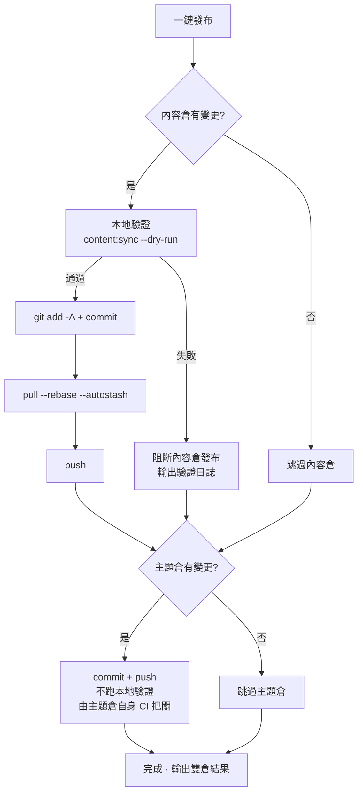

# 提交和發布

後台裡的一切改動都發生在**本地內容倉**，要讓它出現在線上部落格，需要 git 提交並推送。「提交和發布」頁把這件事做成了一鍵操作，並附帶發布前的安全檢查。

## 頁面佈局

- **左欄**：提交訊息輸入、倉庫狀態、最近提交、執行輸出
- **右欄**：變更明細表——兩個倉庫各一張卡，按路徑類型打標籤（文章/說說/資料/設定/資源…），帶新增/修改狀態與彙總列（如「2 篇新文章 · 1 條說說」）

## 發布流程

點「**一鍵發布**」後，對兩個倉庫依次執行（**互不阻斷**，一個失敗不影響另一個）：

幾個關鍵點：

- **發布前強制驗證**：內容倉提交前跑主題倉的 `content:sync --dry-run`（純記憶體預檢 YAML 格式、欄位拼寫、frontmatter schema），**驗證失敗直接阻斷**，杜絕壞內容上線。可隨時點「**僅驗證**」單獨執行，不發起發布
- **推送前自動 rebase**：遠端有新提交（比如你在另一台電腦發過）時，`pull --rebase --autostash` 自動跟進，不需要手動處理
- **主題倉只提交不驗證**：它承載的是內容同步產物，品質由主題倉自己的 CI 把關
- 推送成功後，遠端的建置管線（GitHub Actions 或 Deploy Hook）會自動建置並部署站點

## 提交訊息

兩倉各有獨立輸入框，**留空即自動生成**：

- **內容倉**按變更內容生成，如 `feat(content): 新增文章「hello-world」`；純修改舊文時降級為 `fix`，只發說說則是 `feat(moments): 发布动态`
- **主題倉**按檔案路徑歸類：內容同步 → `chore(content)`、資源 → `chore(assets)`、腳本 → `chore(cli)`…

手動填寫須符合規範 `type(scope): 中文描述`（描述 ≤30 字），格式不對輸入框會標紅提示。訊息過長時懸浮輸入框會跑馬燈滾動展示。

**AI 生成**（AI 啟用時）：點「AI生成」按本倉變更生成提交訊息——AI 會參考最近 12 條提交學習你的風格，輸出必須通過格式驗證才會採用，否則自動回退啟發式生成，**永不阻斷發布**。

## 倉庫狀態與最近提交

「倉庫狀態」卡按內容倉 / 主題倉切換顯示：分支、本地領先（未推送提交數）、落後遠端。

「落後遠端」旁的刷新按鈕做**輕量探測**（`git ls-remote`，不拉取任何程式碼）：

- `0`——與遠端一致
- 精確數字——落後 N 個提交
- 「遠端有新提交（數量需拉取後可知）」——本地快取的遠端引用過期，發布時的自動 rebase 會處理

「最近提交」卡同樣雙倉切換，各顯示最近 20 條（雜湊、說明、日期），發布後立即刷新。

## 執行輸出

發布（或驗證）完成後左欄底部顯示執行輸出：**【內容倉】與【主題倉】各一段**，包含每一步命令結果；驗證失敗時附帶完整驗證日誌（定位到具體檔案與欄位）。綠色「成功」/ 紅色「失敗」標籤一目了然，部分失敗會明確提示是哪一個倉。

## 發布後

- 推送的內容經遠端管線自動建置上線，稍後刷新線上站點驗證
- 本地[真站預覽](./dashboard.md#真站預覽)與線上始終同源，發布前預覽無誤即無 surprises
- 萬一發布了不想要的內容：git 歷史裡 revert 即可，內容倉每次發布都有清晰可追溯的提交

## 下一步

- 恭喜，你已經掌握了 Shirone-Admin 的完整工作流：[寫作](./post-editor.md) → [發布](./publish.md)
- 需要查介面細節時查閱 [API 參考](/zh-hant/api/)
