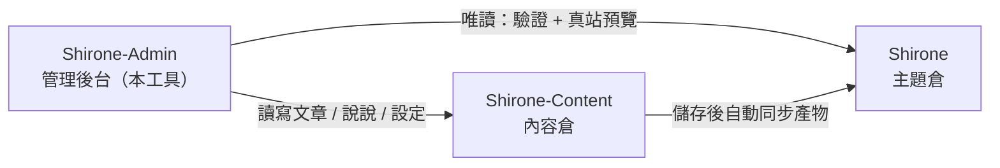

# 快速上手

這篇教程帶你從零把 **Shirone-Admin** 跑起來：準備好它管理的部落格工作區、啟動全部服務，最後在瀏覽器裡打開管理後台。全部步驟照做即可複現，不需要任何背景知識。

完成本教程後，你將擁有：

- 一個正常運行的 Shirone 部落格工作區（主題倉 + 內容倉 + 管理工具）
- 可存取的管理後台 `http://localhost:5173/` 與即時預覽的部落格前台 `http://localhost:4321/`

## 準備工作

開始前請確認本機已安裝：

| 工具 | 版本要求 | 檢查命令 | 說明 |
|------|----------|----------|------|
| Node.js | ≥ 22.12 | `node -v` | JavaScript 執行環境，Shirone-Admin 的前後端都跑在它上面 |
| pnpm | ≥ 9 | `pnpm -v` | 高效能的 Node 套件管理器，三個倉庫統一使用它 |
| git | 任意較新版本 | `git --version` | 用於克隆倉庫，也是後續「一鍵發布」的基礎 |

如果還沒有 pnpm，安裝好 Node.js 後執行：

::: code-group

```powershell [PowerShell]
npm install -g pnpm
```

```bash [macOS / Linux]
npm install -g pnpm
```

:::

> [!NOTE]
> Shirone-Admin 在 Windows 環境下開發驗證。PowerShell 中呼叫 pnpm 需帶 `.cmd` 後綴（如 `pnpm.cmd install`）；macOS / Linux 使用者直接使用 `pnpm` 即可，本文以 PowerShell 為準。

## 認識三倉工作區

Shirone-Admin 不是孤立的工具，它管理的部落格由**三個倉庫**組成，必須放在**同一個父目錄**下：



- **Shirone（主題倉）**：部落格本體，基於 Astro 的主題原始碼。Shirone-Admin 對它唯讀，用於發布前驗證與即時預覽
- **Shirone-Content（內容倉）**：你的文章、說說、資料與設定都存放在這裡，是 Shirone-Admin **唯一的寫入目標**
- **Shirone-Admin（本工具）**：前後端分離的管理工具，替代你手動編輯內容倉檔案

不設定任何環境變數時，Shirone-Admin 會按上圖的相對位置自動找到另外兩個倉庫——這就是三倉必須同目錄的原因。

## 第一步：克隆三個倉庫

任選一個父目錄（下文以 `blogs_ws` 為例），依次克隆：

```powershell
mkdir blogs_ws
cd blogs_ws

git clone https://github.com/LyraVoid/Shirone.git
git clone https://github.com/LyraVoid/Shirone-Content.git
git clone https://github.com/bobokaka/Shirone-Admin.git
```

> [!TIP]
> 如果你已有自己的內容倉（fork 或自建），用你的倉庫位址替換第二條克隆命令即可。Shirone-Admin 寫入的永遠是本地這份內容倉。

完成後目錄結構應為：

```
blogs_ws/
├── Shirone/           # 部落格主題
├── Shirone-Content/   # 內容倉
└── Shirone-Admin/     # 管理工具
```

## 第二步：安裝依賴

兩個倉庫需要安裝依賴：Shirone-Admin 自身，以及 Shirone 主題倉——真站預覽功能依賴主題倉的 `node_modules`。內容倉不需要安裝。

```powershell
cd Shirone-Admin
pnpm.cmd install

cd ..\Shirone
pnpm.cmd install
```

> [!NOTE]
> Shirone 主題使用 Astro 7 + Svelte 5，依賴體積較大，首次安裝需要幾分鐘，屬正常現象。

## 第三步：一鍵啟動

回到 Shirone-Admin 目錄，執行一條命令啟動全部服務：

```powershell
cd ..\Shirone-Admin
node workspace/content-watch.mjs
```

這一條命令會同時完成三件事：

1. **內容倉監聽同步**——你在管理後台儲存內容後，自動同步到主題倉供部落格建置
2. **部落格前台**——啟動主題倉的 `astro dev`，連接埠 `4321`
3. **管理後台**——啟動 API 服務（`5175`）與管理介面（`5173`）

三端就緒後，終端會統一列印存取位址：

```text
博客 http://localhost:4321/
Admin http://localhost:5173/
```

## 第四步：打開管理後台

瀏覽器訪問 `http://localhost:5173/`，即可看到 Shirone-Admin 的管理介面。此時：

- 在後台編輯的內容，會即時寫入本地的 `Shirone-Content` 倉庫
- 打開 `http://localhost:4321/` 可以看到部落格前台的即時渲染效果——與將來發布的真實站點一致

至此，Shirone-Admin 已完全就緒。

## 常見調整

### 倉庫不在同一父目錄，或需要改連接埠

複製 `.env.example` 為 `.env`（放在 `Shirone-Admin` 目錄下），按需修改：

```dotenv
# 內容倉絕對路徑（admin 唯一寫入目標）
CONTENT_DIR=D:\blogs\Shirone-Content

# 主題倉絕對路徑（驗證 dry-run 與真站預覽用）
THEME_DIR=D:\blogs\Shirone

# API 連接埠（預設 5175）
ADMIN_PORT=5175
```

### 只想啟動管理後台

不需要部落格前台預覽時，可以跳過一鍵啟動，只運行 Admin 本體：

```powershell
pnpm.cmd dev
```

這會並行啟動 API 服務（`5175`）與管理介面（`5173`），不含內容同步與部落格 dev。

## 下一步

- 深入理解架構：[三倉工作區](./workspace.md)
- 開始寫作：[文章管理](./posts.md) 與 [文章編輯](./post-editor.md)
- 了解全貌後試一次 [提交和發布](./publish.md)
