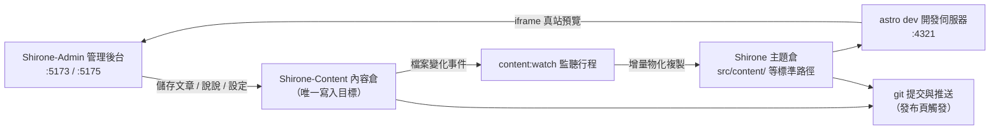

# 三倉工作區

[快速上手](./quick-start.md)裡你已經把三個倉庫克隆到了同一目錄。這一章深入解釋**為什麼是三個倉庫**、**你的內容最終寫到了哪裡**、**部落格是怎麼被建置出來的**——理解這些，後續使用任何功能時你都清楚改動落在了什麼地方。

## 三個倉庫的分工

| 倉庫 | 角色 | Shirone-Admin 對它做什麼 |
|------|------|--------------------------|
| **Shirone**（主題倉） | 部落格本體：Astro 主題原始碼，負責把內容渲染成站點 | **唯讀**——發布前驗證、真站預覽；發布時會把它已跟蹤的同步產物提交推送 |
| **Shirone-Content**（內容倉） | 你的全部內容：文章、說說、結構化資料、站點設定、圖片 | **唯一的寫入目標**——後台的一切增刪改都發生在 |
| **Shirone-Admin**（本工具） | 管理後台：Vue 3 前端 + Fastify 後端 | 自身不存內容，僅保存 AI 服務商設定（`server/data/ai-settings.json`） |

> [!NOTE]
> 「內容倉」是私有倉庫（不公開），「主題倉」與「工具倉」是開源倉庫。程式碼與內容分離，意味著你可以放心公開自己的部落格建置設定，而文章與個人資訊永遠留在私有倉裡。

## 資料是怎麼流動的

在後台點下「儲存」之後，資料沿下面的鏈路流動：



1. **寫入內容倉**——後台每次儲存，檔案直接寫入 `Shirone-Content` 對應目錄
2. **監聽同步**——`content:watch` 行程檢測到內容倉變化，把檔案增量複製到主題倉的標準路徑（這一步叫**物化**：真實複製檔案，而不是軟連結）
3. **即時建置**——主題倉的 `astro dev` 開發伺服器重新編譯，瀏覽器裡的真站預覽隨之刷新
4. **發布上線**——在[提交和發布](./publish.md)頁對兩個倉庫執行 git 提交與推送

> [!IMPORTANT]
> 永遠不要直接修改主題倉裡 `src/content/` 下的檔案——它們是同步產物，下次同步會被內容倉的版本覆蓋。所有內容改動都應透過後台（或直接改內容倉）進行。

## 連接埠一覽

| 連接埠 | 服務 | 綁定 | 說明 |
|------|------|------|------|
| `5173` | 管理後台介面 | localhost | Vue 3 前端（Vite dev server），瀏覽器打開的就是它 |
| `5175` | API 服務 | **僅 127.0.0.1** | Fastify 後端，所有資料操作經它落盤；`/api` 前綴 |
| `4321` | 部落格前台 | localhost | 主題倉 `astro dev`，真站預覽 iframe 指向這裡 |

API 服務只綁定本機回送位址，不暴露到區域網路——這是本地單機工具的安全邊界。5175 被殘留實例佔用時，服務啟動會自動清理後重試。

## 環境變數

三個倉庫放在同一父目錄時**無需任何設定**——Shirone-Admin 按相對位置自動定位內容倉與主題倉。倉庫分離存放、或需要改連接埠時，在 `Shirone-Admin` 目錄下建立 `.env`（可從 `.env.example` 複製）：

```dotenv
# 內容倉絕對路徑（admin 唯一寫入目標）
CONTENT_DIR=D:\blogs\Shirone-Content

# 主題倉絕對路徑（發布前驗證與真站預覽用）
THEME_DIR=D:\blogs\Shirone

# API 連接埠（預設 5175）
ADMIN_PORT=5175
```

| 變數 | 預設值 | 說明 |
|------|--------|------|
| `CONTENT_DIR` | `../Shirone-Content`（相對本工具倉解析） | 內容倉根目錄。**連接判定**：該目錄下存在 `content/` 即視為已連接 |
| `THEME_DIR` | `../Shirone` | 主題倉根目錄。**連接判定**：該目錄下存在 `scripts/content/sync.mjs`；`node_modules` 存在才可執行本地驗證 |
| `ADMIN_PORT` | `5175` | API 服務連接埠。特意不使用 `PORT` 這類通用名，避免被其他工具的設定意外劫持 |
| `DEPLOY_HOST` / `DEPLOY_REMOTE_DIR` | 無 | `workspace/deploy.mjs` 一鍵部署腳本使用（需 SSH 免密），與日常使用無關 |

修改 `.env` 後重啟服務生效。

## 連接狀態怎麼看

管理後台**頂欄右側**的標籤即時顯示內容倉連接狀態（「已連接」/「未連接」），它來自 `GET /api/status` 的探測結果。顯示「未連接」時按順序檢查：

1. `.env` 裡 `CONTENT_DIR` 路徑是否正確
2. 該目錄下是否存在 `content/` 子目錄（空內容倉也能連接，但沒有 `content/` 會被判為無效）

主題倉連接狀態不顯示在頂欄，但會影響兩處功能：未連接時發布頁不顯示主題倉資訊；`node_modules` 未安裝時發布前無法執行本地驗證。

## 兩種啟動方式

```powershell
# 方式一：一鍵啟動（推薦）——內容監聽 + 部落格前台 + 管理後台三件套
node workspace/content-watch.mjs

# 方式二：只啟動管理後台——API(:5175) + 介面(:5173)，不含內容同步與部落格前台
pnpm.cmd dev
```

方式一啟動時會先清理 4321 / 5173 / 5175 三個連接埠的殘留行程，再依次拉起：

1. 主題倉的 `pnpm content:watch --quiet`（內容倉監聽同步）
2. 主題倉的 `pnpm dev`（Astro dev server，:4321）
3. Shirone-Admin 的 `pnpm dev`（server + client 並行）

三端透過 HTTP 探活確認就緒後，終端統一列印存取位址。即使不用一鍵腳本，只要 4321 連接埠上有任何來源的 Astro dev server 在跑，後台的[真站預覽](./dashboard.md#真站預覽)就能直接用——預覽面板只探測連接埠，不關心行程是誰啟動的。

## 內容倉裡有什麼

了解各目錄的用途，排查問題、手動備份時都用得上：

```
Shirone-Content/
├── content/
│   ├── posts/          # 文章：<slug>/index.md（目錄式）或平鋪 *.md
│   │   └── hello/
│   │       ├── index.md
│   │       └── images/ # 該文章的配圖
│   └── moments/        # 說說：<yyyymmdd-HHmmss>.md
├── config/             # 站點設定 YAML（site/profile/nav-bar/footer）
│   └── footer.html     # 頁尾自訂 HTML
├── data/               # 結構化資料（projects/skills/timeline/… 8 類 *.ts）
├── assets/             # 參與建置期壓縮轉碼的圖片（橫幅、頭像等）
└── public/             # 原樣發布的資源（說說圖、音樂、番劇封面等）
```

其中三處是**建置期派生資源，禁止改動**（主題建置腳本管理，手動改會破壞建置）：

- `public/assets/moments/thumbnails/**` —— 說說縮圖
- `public/assets/anime/covers/**` —— 番劇封面快取
- 各字型子集目錄（`**/.subset/**`）

## 下一步

- 回到[儀表板](./dashboard.md)認識管理後台的每個區域
- 直接開始[寫第一篇文章](./posts.md)
