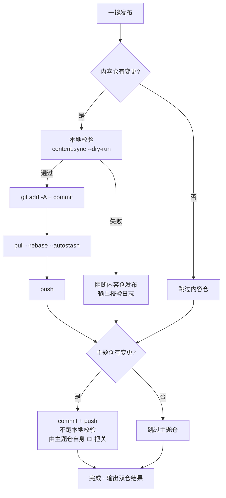

# 提交和发布

后台里的一切改动都发生在**本地内容仓**，要让它出现在线上博客，需要 git 提交并推送。「提交和发布」页把这件事做成了一键操作，并附带发布前的安全检查。

## 页面布局

- **左栏**：提交信息输入、仓库状态、最近提交、执行输出
- **右栏**：变更明细表——两个仓库各一张卡，按路径类型打标签（文章/说说/数据/配置/资源…），带新增/修改状态与汇总行（如「2 篇新文章 · 1 条说说」）

## 发布流程

点「**一键发布**」后，对两个仓库依次执行（**互不阻断**，一个失败不影响另一个）：

几个关键点：

- **发布前强制校验**：内容仓提交前跑主题仓的 `content:sync --dry-run`（纯内存预检 YAML 格式、字段拼写、frontmatter schema），**校验失败直接阻断**，杜绝坏内容上线。可随时点「**仅校验**」单独执行，不发起发布
- **推送前自动 rebase**：远端有新提交（比如你在另一台电脑发过）时，`pull --rebase --autostash` 自动跟进，不需要手动处理
- **主题仓只提交不校验**：它承载的是内容同步产物，质量由主题仓自己的 CI 把关
- 推送成功后，远端的构建流水线（GitHub Actions 或 Deploy Hook）会自动构建并部署站点

## 提交信息

两仓各有独立输入框，**留空即自动生成**：

- **内容仓**按变更内容生成，如 `feat(content): 新增文章「hello-world」`；纯修改旧文时降级为 `fix`，只发说说则是 `feat(moments): 发布动态`
- **主题仓**按文件路径归类：内容同步 → `chore(content)`、资源 → `chore(assets)`、脚本 → `chore(cli)`…

手动填写须符合规范 `type(scope): 中文描述`（描述 ≤30 字），格式不对输入框会标红提示。信息过长时悬浮输入框会跑马灯滚动展示。

**AI 生成**（AI 启用时）：点「AI生成」按本仓变更生成提交信息——AI 会参考最近 12 条提交学习你的风格，输出必须通过格式校验才会采用，否则自动回退启发式生成，**永不阻断发布**。

## 仓库状态与最近提交

「仓库状态」卡按内容仓 / 主题仓切换显示：分支、本地领先（未推送提交数）、落后远端。

「落后远端」旁的刷新按钮做**轻量探测**（`git ls-remote`，不拉取任何代码）：

- `0`——与远端一致
- 精确数字——落后 N 个提交
- 「远端有新提交（数量需拉取后可知）」——本地缓存的远端引用过期，发布时的自动 rebase 会处理

「最近提交」卡同样双仓切换，各显示最近 20 条（哈希、说明、日期），发布后立即刷新。

## 执行输出

发布（或校验）完成后左栏底部显示执行输出：**【内容仓】与【主题仓】各一段**，包含每一步命令结果；校验失败时附带完整校验日志（定位到具体文件与字段）。绿色「成功」/ 红色「失败」标签一目了然，部分失败会明确提示是哪一个仓。

## 发布后

- 推送的内容经远端流水线自动构建上线，稍后刷新线上站点验证
- 本地[真站预览](./dashboard.md#真站预览)与线上始终同源，发布前预览无误即无 surprises
- 万一发布了不想要的内容：git 历史里 revert 即可，内容仓每次发布都有清晰可追溯的提交

## 下一步

- 恭喜，你已经掌握了 Shirone-Admin 的完整工作流：[写作](./post-editor.md) → [发布](./publish.md)
- 需要查接口细节时查阅 [API 参考](/zh/api/)
