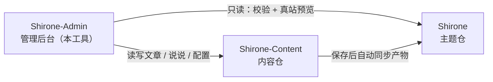

# 快速上手

这篇教程带你从零把 **Shirone-Admin** 跑起来：准备好它管理的博客工作区、启动全部服务，最后在浏览器里打开管理后台。全部步骤照做即可复现，不需要任何背景知识。

完成本教程后，你将拥有：

- 一个正常运行的 Shirone 博客工作区（主题仓 + 内容仓 + 管理工具）
- 可访问的管理后台 `http://localhost:5173/` 与实时预览的博客前台 `http://localhost:4321/`

## 准备工作

开始前请确认本机已安装：

| 工具 | 版本要求 | 检查命令 | 说明 |
|------|----------|----------|------|
| Node.js | ≥ 22.12 | `node -v` | JavaScript 运行时，Shirone-Admin 的前后端都跑在它上面 |
| pnpm | ≥ 9 | `pnpm -v` | 高性能的 Node 包管理器，三个仓库统一使用它 |
| git | 任意较新版本 | `git --version` | 用于克隆仓库，也是后续「一键发布」的基础 |

如果还没有 pnpm，安装好 Node.js 后执行：

::: code-group

```powershell [PowerShell]
npm install -g pnpm
```

```bash [macOS / Linux]
npm install -g pnpm
```

:::

> [!NOTE]
> Shirone-Admin 在 Windows 环境下开发验证。PowerShell 中调用 pnpm 需带 `.cmd` 后缀（如 `pnpm.cmd install`）；macOS / Linux 用户直接使用 `pnpm` 即可，本文以 PowerShell 为准。

## 认识三仓工作区

Shirone-Admin 不是孤立的工具，它管理的博客由**三个仓库**组成，必须放在**同一个父目录**下：



- **Shirone（主题仓）**：博客本体，基于 Astro 的主题源码。Shirone-Admin 对它只读，用于发布前校验与实时预览
- **Shirone-Content（内容仓）**：你的文章、说说、数据与配置都存放在这里，是 Shirone-Admin **唯一的写入目标**
- **Shirone-Admin（本工具）**：前后端分离的管理工具，替代你手动编辑内容仓文件

不配置任何环境变量时，Shirone-Admin 会按上图的相对位置自动找到另外两个仓库——这就是三仓必须同目录的原因。

## 第一步：克隆三个仓库

任选一个父目录（下文以 `blogs_ws` 为例），依次克隆：

```powershell
mkdir blogs_ws
cd blogs_ws

git clone https://github.com/LyraVoid/Shirone.git
git clone https://github.com/LyraVoid/Shirone-Content.git
git clone https://github.com/bobokaka/Shirone-Admin.git
```

> [!TIP]
> 如果你已有自己的内容仓（fork 或自建），用你的仓库地址替换第二条克隆命令即可。Shirone-Admin 写入的永远是本地这份内容仓。

完成后目录结构应为：

```
blogs_ws/
├── Shirone/           # 博客主题
├── Shirone-Content/   # 内容仓
└── Shirone-Admin/     # 管理工具
```

## 第二步：安装依赖

两个仓库需要安装依赖：Shirone-Admin 自身，以及 Shirone 主题仓——真站预览功能依赖主题仓的 `node_modules`。内容仓不需要安装。

```powershell
cd Shirone-Admin
pnpm.cmd install

cd ..\Shirone
pnpm.cmd install
```

> [!NOTE]
> Shirone 主题使用 Astro 7 + Svelte 5，依赖体积较大，首次安装需要几分钟，属正常现象。

## 第三步：一键启动

回到 Shirone-Admin 目录，执行一条命令启动全部服务：

```powershell
cd ..\Shirone-Admin
node workspace/content-watch.mjs
```

这一条命令会同时完成三件事：

1. **内容仓监听同步**——你在管理后台保存内容后，自动同步到主题仓供博客构建
2. **博客前台**——启动主题仓的 `astro dev`，端口 `4321`
3. **管理后台**——启动 API 服务（`5175`）与管理界面（`5173`）

三端就绪后，终端会统一打印访问地址：

```text
博客 http://localhost:4321/
Admin http://localhost:5173/
```

## 第四步：打开管理后台

浏览器访问 `http://localhost:5173/`，即可看到 Shirone-Admin 的管理界面。此时：

- 在后台编辑的内容，会实时写入本地的 `Shirone-Content` 仓库
- 打开 `http://localhost:4321/` 可以看到博客前台的实时渲染效果——与将来发布的真实站点一致

至此，Shirone-Admin 已完全就绪。

## 常见调整

### 仓库不在同一父目录，或需要改端口

复制 `.env.example` 为 `.env`（放在 `Shirone-Admin` 目录下），按需修改：

```dotenv
# 内容仓绝对路径（admin 唯一写入目标）
CONTENT_DIR=D:\blogs\Shirone-Content

# 主题仓绝对路径（校验 dry-run 与真站预览用）
THEME_DIR=D:\blogs\Shirone

# API 端口（默认 5175）
ADMIN_PORT=5175
```

### 只想启动管理后台

不需要博客前台预览时，可以跳过一键启动，只运行 Admin 本体：

```powershell
pnpm.cmd dev
```

这会并行启动 API 服务（`5175`）与管理界面（`5173`），不含内容同步与博客 dev。

## 下一步

- 浏览 [Shirone-Admin 仓库](https://github.com/bobokaka/Shirone-Admin)，了解功能全貌
- 更多功能教程（文章编辑、说说发布、AI 助手、一键发布等）将陆续补充到 [指南](./index.md)
