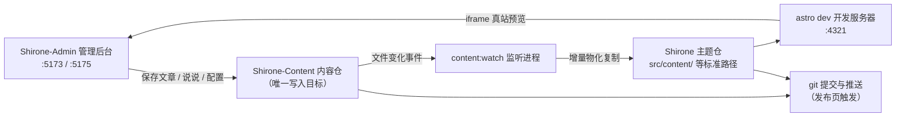

# 三仓工作区

[快速上手](./quick-start.md)里你已经把三个仓库克隆到了同一目录。这一章深入解释**为什么是三个仓库**、**你的内容最终写到了哪里**、**博客是怎么被构建出来的**——理解这些，后续使用任何功能时你都清楚改动落在了什么地方。

## 三个仓库的分工

| 仓库 | 角色 | Shirone-Admin 对它做什么 |
|------|------|--------------------------|
| **Shirone**（主题仓） | 博客本体：Astro 主题源码，负责把内容渲染成站点 | **只读**——发布前校验、真站预览；发布时会把它已跟踪的同步产物提交推送 |
| **Shirone-Content**（内容仓） | 你的全部内容：文章、说说、结构化数据、站点配置、图片 | **唯一的写入目标**——后台的一切增删改都发生在 |
| **Shirone-Admin**（本工具） | 管理后台：Vue 3 前端 + Fastify 后端 | 自身不存内容，仅保存 AI 服务商配置（`server/data/ai-settings.json`） |

> [!NOTE]
> 「内容仓」是私有仓库（不公开），「主题仓」与「工具仓」是开源仓库。代码与内容分离，意味着你可以放心公开自己的博客构建配置，而文章与个人信息永远留在私有仓里。

## 数据是怎么流动的

在后台点下「保存」之后，数据沿下面的链路流动：



1. **写入内容仓**——后台每次保存，文件直接写入 `Shirone-Content` 对应目录
2. **监听同步**——`content:watch` 进程检测到内容仓变化，把文件增量复制到主题仓的标准路径（这一步叫**物化**：真实复制文件，而不是软链接）
3. **实时构建**——主题仓的 `astro dev` 开发服务器重新编译，浏览器里的真站预览随之刷新
4. **发布上线**——在[提交和发布](./publish.md)页对两个仓库执行 git 提交与推送

> [!IMPORTANT]
> 永远不要直接修改主题仓里 `src/content/` 下的文件——它们是同步产物，下次同步会被内容仓的版本覆盖。所有内容改动都应通过后台（或直接改内容仓）进行。

## 端口一览

| 端口 | 服务 | 绑定 | 说明 |
|------|------|------|------|
| `5173` | 管理后台界面 | localhost | Vue 3 前端（Vite dev server），浏览器打开的就是它 |
| `5175` | API 服务 | **仅 127.0.0.1** | Fastify 后端，所有数据操作经它落盘；`/api` 前缀 |
| `4321` | 博客前台 | localhost | 主题仓 `astro dev`，真站预览 iframe 指向这里 |

API 服务只绑定本机回环地址，不暴露到局域网——这是本地单机工具的安全边界。5175 被残留实例占用时，服务启动会自动清理后重试。

## 环境变量

三个仓库放在同一父目录时**无需任何配置**——Shirone-Admin 按相对位置自动定位内容仓与主题仓。仓库分离存放、或需要改端口时，在 `Shirone-Admin` 目录下创建 `.env`（可从 `.env.example` 复制）：

```dotenv
# 内容仓绝对路径（admin 唯一写入目标）
CONTENT_DIR=D:\blogs\Shirone-Content

# 主题仓绝对路径（发布前校验与真站预览用）
THEME_DIR=D:\blogs\Shirone

# API 端口（默认 5175）
ADMIN_PORT=5175
```

| 变量 | 默认值 | 说明 |
|------|--------|------|
| `CONTENT_DIR` | `../Shirone-Content`（相对本工具仓解析） | 内容仓根目录。**连接判定**：该目录下存在 `content/` 即视为已连接 |
| `THEME_DIR` | `../Shirone` | 主题仓根目录。**连接判定**：该目录下存在 `scripts/content/sync.mjs`；`node_modules` 存在才可执行本地校验 |
| `ADMIN_PORT` | `5175` | API 服务端口。特意不使用 `PORT` 这类通用名，避免被其他工具的配置意外劫持 |
| `DEPLOY_HOST` / `DEPLOY_REMOTE_DIR` | 无 | `workspace/deploy.mjs` 一键部署脚本使用（需 SSH 免密），与日常使用无关 |

修改 `.env` 后重启服务生效。

## 连接状态怎么看

管理后台**顶栏右侧**的标签实时显示内容仓连接状态（「已连接」/「未连接」），它来自 `GET /api/status` 的探测结果。显示「未连接」时按顺序检查：

1. `.env` 里 `CONTENT_DIR` 路径是否正确
2. 该目录下是否存在 `content/` 子目录（空内容仓也能连接，但没有 `content/` 会被判为无效）

主题仓连接状态不显示在顶栏，但会影响两处功能：未连接时发布页不显示主题仓信息；`node_modules` 未安装时发布前无法执行本地校验。

## 两种启动方式

```powershell
# 方式一：一键启动（推荐）——内容监听 + 博客前台 + 管理后台三件套
node workspace/content-watch.mjs

# 方式二：只启动管理后台——API(:5175) + 界面(:5173)，不含内容同步与博客前台
pnpm.cmd dev
```

方式一启动时会先清理 4321 / 5173 / 5175 三个端口的残留进程，再依次拉起：

1. 主题仓的 `pnpm content:watch --quiet`（内容仓监听同步）
2. 主题仓的 `pnpm dev`（Astro dev server，:4321）
3. Shirone-Admin 的 `pnpm dev`（server + client 并行）

三端通过 HTTP 探活确认就绪后，终端统一打印访问地址。即使不用一键脚本，只要 4321 端口上有任何来源的 Astro dev server 在跑，后台的[真站预览](./dashboard.md#真站预览)就能直接用——预览面板只探测端口，不关心进程是谁启动的。

## 内容仓里有什么

了解各目录的用途，排查问题、手动备份时都用得上：

```
Shirone-Content/
├── content/
│   ├── posts/          # 文章：<slug>/index.md（目录式）或平铺 *.md
│   │   └── hello/
│   │       ├── index.md
│   │       └── images/ # 该文章的配图
│   └── moments/        # 说说：<yyyymmdd-HHmmss>.md
├── config/             # 站点配置 YAML（site/profile/nav-bar/footer）
│   └── footer.html     # 页脚自定义 HTML
├── data/               # 结构化数据（projects/skills/timeline/… 8 类 *.ts）
├── assets/             # 参与构建期压缩转码的图片（横幅、头像等）
└── public/             # 原样发布的资源（说说图、音乐、番剧封面等）
```

其中三处是**构建期派生资源，禁止改动**（主题构建脚本管理，手动改会破坏构建）：

- `public/assets/moments/thumbnails/**` —— 说说缩略图
- `public/assets/anime/covers/**` —— 番剧封面缓存
- 各字体子集目录（`**/.subset/**`）

## 下一步

- 回到[仪表盘](./dashboard.md)认识管理后台的每个区域
- 直接开始[写第一篇文章](./posts.md)
